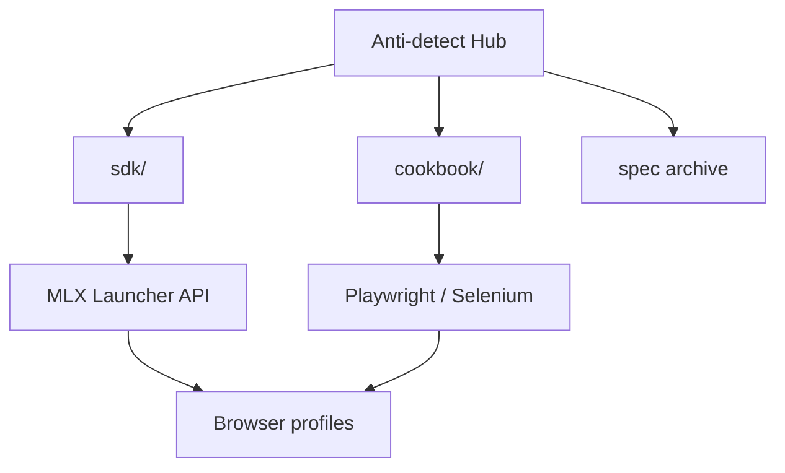

<!--
title: Anti-detect Browser & Multilogin X — Documentación en Español
description: Hub Multilogin X #1 — 12 recetas API, CLI mlx, Cloud Real Phone (MIN50), SDK Playwright/Selenium, comparación GoLogin/AdsPower
keywords: navegador anti-detect, Multilogin X, Cloud Real Phone, MIN50, SAAS50, fingerprint, Playwright, Selenium, MMO
homepage: https://multilogin.com/pricing/?utm_source=saas&utm_medium=partner&a_aid=saas&a_bid=f5fad549
lang: es
-->

# Anti-detect Browser · Fingerprinting · Multilogin X

**Hub autocontenido** para **navegador anti-detect**, **browser fingerprinting**, automatización de la API **Multilogin X (MLX)** y flujos **Playwright / Selenium** stealth.

Todo lo que necesitas — SDK, cookbook API, guías y archivo Postman — está **en este repositorio**.

> **Multilogin X — [Precios](https://multilogin.com/pricing/?utm_source=saas&utm_medium=partner&a_aid=saas&a_bid=f5fad549)** · **`SAAS50`** (código promo Multilogin) · **`MIN50`** (Multilogin Cloud Real Phone)

<p align="left">
  <a href="https://multilogin.com/pricing/?utm_source=saas&utm_medium=partner&a_aid=saas&a_bid=f5fad549"></a>
</p>

<p align="left">
  
  
  <a href="README.md"></a>
  <a href="README.vi.md"></a>
  <a href="README.zh-CN.md"></a>
  <a href="README.ru.md"></a>
  <a href="README.id.md"></a>
  <a href="README.pt-BR.md"></a>
  <a href="README.ko.md"></a>
  <a href="README.ja.md"></a>
  <a href="README.th.md"></a>
  <a href="README.es.md"></a>
  <a href="LICENSE"></a>
  <a href="SECURITY.md"></a>
</p>

<p align="left">
  
  
  
</p>

## Tabla de contenidos

- [Por qué #1 en GitHub](#por-qué-1-en-github-para-multilogin)
- [Qué es este repositorio](#qué-es-este-repositorio)
- [Cloud Real Phone (MIN50)](#multilogin-cloud-real-phone)
- [Inicio rápido](#inicio-rápido)
- [SDK & Cookbook API](#sdk--cookbook-api-multilogin-x)
- [Comparar & elegir](#comparar--elegir)
- [Documentación](#documentación)
- [FAQ](#preguntas-frecuentes)
- [Precios Multilogin](#precios-multilogin)
- [Idiomas](#idiomas)

---

## Por qué #1 en GitHub para Multilogin

| | Este hub |
|---|----------|
| **Recetas** | **12** cookbook + Python ejecutable |
| **CLI** | `mlx start` · `stop` · `profiles export` · `doctor` |
| **SDK** | Python, C#, Java, Node, cURL |
| **Cloud** | `profile/search`, refresh de token, sharding |
| **Mobile** | [Cloud Real Phone](docs/multilogin-cloud-real-phone.md) + **`MIN50`** |
| **Idiomas** | 10 README multilingües |
| **Comparaciones** | vs [GoLogin](docs/comparison-multilogin-vs-gologin.md), [AdsPower](docs/comparison-multilogin-vs-adspower.md) |

Detalles: [docs/why-this-hub.md](docs/why-this-hub.md)

---

## Qué es este repositorio

README oficial del perfil GitHub [@Anti-detect](https://github.com/Anti-detect): **hub de documentación + SDK** (MIT) que incluye:

- **Navegador anti-detect** / aislamiento de fingerprint
- **Multilogin X** Local Launcher API (start, stop, quick profile)
- **Código ejecutable** en [`sdk/`](sdk/) — Python, C#, Java, Node, cURL
- **Recetas reales** en [docs/multilogin-api/cookbook/](docs/multilogin-api/cookbook/)
- **Archivo Postman** en [docs/multilogin-api/spec/](docs/multilogin-api/spec/)

| Audiencia | Caso de uso |
|-----------|-------------|
| Ingenieros de automatización | Playwright / Selenium en perfiles MLX |
| Equipos MMO & growth | Aislamiento multi-cuenta + rotación |
| Desarrolladores | Referencia API, SDK, smoke tests |
| Mobile / MMO | [Cloud Real Phone](docs/multilogin-cloud-real-phone.md) + fleet desktop |

---

## Multilogin Cloud Real Phone

**Dispositivos Android reales en la nube** — fingerprints móviles genuinos para plataformas que penalizan la automatización desktop.

| | |
|---|---|
| **Guía** | [docs/multilogin-cloud-real-phone.md](docs/multilogin-cloud-real-phone.md) |
| **MMO móvil** | [docs/mobile-mmo-playbook.md](docs/mobile-mmo-playbook.md) |
| **Promo** | **`MIN50`** en [Multilogin pricing](https://multilogin.com/pricing/?utm_source=saas&utm_medium=partner&a_aid=saas&a_bid=f5fad549) |

La automatización desktop usa Launcher API ([cookbook](docs/multilogin-api/cookbook/)); las sesiones móviles usan Cloud Real Phone con las mismas reglas de workspace.

---

## Inicio rápido

| Paso | Acción |
|------|--------|
| 1 | Instalar Multilogin X y crear un perfil de navegador |
| 2 | Obtener UUIDs folder/profile → [docs/token-and-ids.md](docs/token-and-ids.md) |
| 3 | `cp sdk/config.example.env sdk/.env` y completar IDs |
| 4 | `cd sdk/python && pip install -e .` (instala CLI `mlx`) |
| 5 | `mlx doctor` → `mlx start` o [`recipes/01`](sdk/python/recipes/01_saved_profile_lifecycle.py) |
| 6 | Línea móvil → [Cloud Real Phone](docs/multilogin-cloud-real-phone.md) · **`MIN50`** |
| 7 | Plan desktop → [Multilogin pricing](https://multilogin.com/pricing/?utm_source=saas&utm_medium=partner&a_aid=saas&a_bid=f5fad549) · **`SAAS50`** |

Completo: [docs/getting-started.md](docs/getting-started.md)

---

## SDK & Cookbook API Multilogin X

| Capa | Enlace |
|------|--------|
| **SDK** | [`sdk/`](sdk/) — `mlx_client`, start/stop/quick |
| **Cookbook** | [docs/multilogin-api/cookbook/](docs/multilogin-api/cookbook/) — **12** recetas |
| **Cloud API** | [docs/multilogin-api/cloud-api.md](docs/multilogin-api/cloud-api.md) · `mlx profiles export` |
| **Referencia API** | [docs/multilogin-api/](docs/multilogin-api/) |
| **Archivo Postman** | [docs/multilogin-api/spec/](docs/multilogin-api/spec/) |
| **Mapa de bibliotecas** | [docs/libraries.md](docs/libraries.md) |

```text
sdk/python/
├── mlx_client.py          # cliente Launcher reutilizable
├── mlx_helpers.py         # CDP URL, quick v3, retry
├── automation_patterns.py # login + attach Playwright/Selenium
└── recipes/               # 12 flujos: lifecycle, rotación, export cloud
```

| # | Receta | Escenario |
|---|--------|-----------|
| 01–05 | Lifecycle → smoke | Launcher core + CI |
| 06 | Retry | Fallos transitorios del launcher |
| 07–08 | Login, Selenium | Attach en producción |
| 09–11 | Cookies | Warm, export, import |
| 12 | Cloud + workers | `profiles.json` + sharding |

Postman: https://documenter.getpostman.com/view/28533318/2s946h9Cv9

---

**¿Más perfiles?** [Multilogin pricing](https://multilogin.com/pricing/?utm_source=saas&utm_medium=partner&a_aid=saas&a_bid=f5fad549) — **`SAAS50`** o **`MIN50`** al pagar.

---

## Arquitectura



Detalles: [docs/architecture.md](docs/architecture.md)

---

## Comparar & elegir

| Documento | Intención de búsqueda |
|-----------|----------------------|
| [vs GoLogin](docs/comparison-multilogin-vs-gologin.md) | Alternativa a Multilogin |
| [vs AdsPower](docs/comparison-multilogin-vs-adspower.md) | Alternativa a AdsPower |
| [vs Chrome](docs/comparison-anti-detect-vs-chrome.md) | Por qué anti-detect |
| [Use cases](docs/use-cases.md) | Por industria |
| [Why this hub](docs/why-this-hub.md) | Hub MLX open-source #1 |

---

## Guías

| Tema | Documento |
|------|-----------|
| Cloud Real Phone | [docs/multilogin-cloud-real-phone.md](docs/multilogin-cloud-real-phone.md) |
| Playwright + MLX | [docs/playwright-mlx-integration.md](docs/playwright-mlx-integration.md) |
| MMO / multi-cuenta | [docs/mmo-automation-guide.md](docs/mmo-automation-guide.md) |
| MMO móvil | [docs/mobile-mmo-playbook.md](docs/mobile-mmo-playbook.md) |
| Solución de problemas | [docs/troubleshooting.md](docs/troubleshooting.md) |
| QA fingerprint | [docs/fingerprint-checklist.md](docs/fingerprint-checklist.md) |
| Mercado | [docs/browser-landscape.md](docs/browser-landscape.md) |

---

## Preguntas frecuentes

### ¿Qué es un navegador anti-detect?

Software que aísla fingerprints, almacenamiento y proxies para que cada perfil parezca un dispositivo distinto.

### ¿Dónde está el código?

En este repo: [`sdk/`](sdk/) y [cookbook](docs/multilogin-api/cookbook/).

### ¿Cómo obtengo IDs de perfil?

[docs/token-and-ids.md](docs/token-and-ids.md)

### ¿Descuento en Multilogin X?

**`SAAS50`** o **`MIN50`** en [Multilogin pricing](https://multilogin.com/pricing/?utm_source=saas&utm_medium=partner&a_aid=saas&a_bid=f5fad549).

Más: [docs/faq.md](docs/faq.md)

---

## Precios Multilogin

| Código | Etiqueta | Cuándo usar |
|--------|----------|-------------|
| **`SAAS50`** | Promo Multilogin | Plan MLX nuevo, primera compra |
| **`MIN50`** | Multilogin Cloud Real Phone | Cloud Real Phone / paquete entry |

**Checkout:** [Multilogin pricing](https://multilogin.com/pricing/?utm_source=saas&utm_medium=partner&a_aid=saas&a_bid=f5fad549) · [docs/urls.md](docs/urls.md) · [pricing-cta.md](docs/pricing-cta.md)

---

## Idiomas

| Idioma | README |
|--------|--------|
| English | [README.md](README.md) |
| Tiếng Việt | [README.vi.md](README.vi.md) |
| 中文 | [README.zh-CN.md](README.zh-CN.md) |
| Русский | [README.ru.md](README.ru.md) |
| Indonesia | [README.id.md](README.id.md) |
| Português (BR) | [README.pt-BR.md](README.pt-BR.md) |
| 한국어 | [README.ko.md](README.ko.md) |
| 日本語 | [README.ja.md](README.ja.md) |
| ไทย | [README.th.md](README.th.md) |
| Español | Estás aquí |

[Índice](docs/locales.md)

---

## Documentación

| Documento | Propósito |
|-----------|-----------|
| [docs/README.md](docs/README.md) | Índice de documentación |
| [docs/getting-started.md](docs/getting-started.md) | Rutas de onboarding |
| [docs/multilogin-cloud-real-phone.md](docs/multilogin-cloud-real-phone.md) | Cloud Real Phone + MIN50 |
| [docs/troubleshooting.md](docs/troubleshooting.md) | Corregir launcher/CDP/cloud |
| [docs/repository-map.md](docs/repository-map.md) | Mapa del repo |
| [docs/token-and-ids.md](docs/token-and-ids.md) | UUIDs y tokens |
| [docs/architecture.md](docs/architecture.md) | Arquitectura |
| [docs/multilogin-api/cookbook/](docs/multilogin-api/cookbook/) | Recetas API |
| [sdk/README.md](sdk/README.md) | SDK |
| [docs/maintenance.md](docs/maintenance.md) | Mantenimiento |
| [docs/disclaimer.md](docs/disclaimer.md) | Disclaimer |
| [CONTRIBUTING.md](CONTRIBUTING.md) | Contribuir |
| [SECURITY.md](SECURITY.md) | Seguridad |
| [CHANGELOG.md](CHANGELOG.md) | Historial |

---

<p align="center">
  <strong><a href="https://multilogin.com/pricing/?utm_source=saas&utm_medium=partner&a_aid=saas&a_bid=f5fad549">Obtener Multilogin X</a></strong> — <code>SAAS50</code> · <code>MIN50</code> (Cloud Real Phone)
</p>

<p align="center">
  <sub>Anti-detect browser · Browser fingerprinting · Multilogin X · Playwright · Selenium</sub>
</p>
