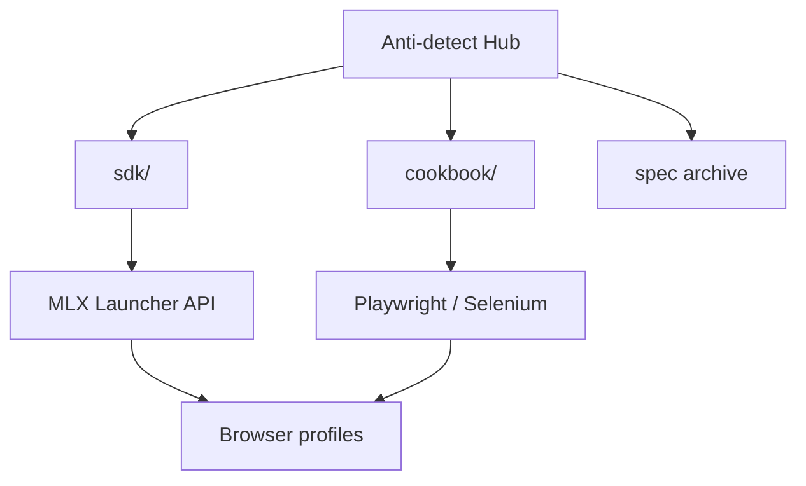

<!--
title: Anti-detect Browser & Multilogin X — Dokumentasi Bahasa Indonesia
description: Hub Multilogin X #1 — 12 resep API, CLI mlx, Cloud Real Phone (MIN50), SDK Playwright/Selenium, perbandingan GoLogin/AdsPower
keywords: browser anti-detect, Multilogin X, Cloud Real Phone, MIN50, SAAS50, fingerprint, Playwright, Selenium, MMO
homepage: https://multilogin.com/pricing/?utm_source=saas&utm_medium=partner&a_aid=saas&a_bid=f5fad549
lang: id
-->

# Anti-detect Browser · Fingerprinting · Multilogin X

**Hub mandiri** untuk **browser anti-detect**, **browser fingerprinting**, otomasi API **Multilogin X (MLX)**, dan workflow **Playwright / Selenium** stealth.

Semua yang Anda butuhkan — SDK, cookbook API, panduan, dan arsip Postman — ada **di repo ini**.

> **Multilogin X — [Harga](https://multilogin.com/pricing/?utm_source=saas&utm_medium=partner&a_aid=saas&a_bid=f5fad549)** · **`SAAS50`** (kode promo Multilogin) · **`MIN50`** (Multilogin Cloud Real Phone)

<p align="left">
  <a href="https://multilogin.com/pricing/?utm_source=saas&utm_medium=partner&a_aid=saas&a_bid=f5fad549"></a>
</p>

<p align="left">
  
  
  <a href="README.md"></a>
  <a href="README.vi.md"></a>
  <a href="README.zh-CN.md"></a>
  <a href="README.ru.md"></a>
  <a href="README.id.md"></a>
  <a href="README.pt-BR.md"></a>
  <a href="README.ko.md"></a>
  <a href="README.ja.md"></a>
  <a href="README.th.md"></a>
  <a href="README.es.md"></a>
  <a href="LICENSE"></a>
  <a href="SECURITY.md"></a>
</p>

<p align="left">
  
  
  
</p>

## Daftar isi

- [Mengapa #1 di GitHub](#mengapa-1-di-github-untuk-multilogin)
- [Apa itu repo ini](#apa-itu-repo-ini)
- [Cloud Real Phone (MIN50)](#multilogin-cloud-real-phone)
- [Mulai cepat](#mulai-cepat)
- [SDK & Cookbook API](#sdk--cookbook-api-multilogin-x)
- [Bandingkan & pilih](#bandingkan--pilih)
- [Dokumentasi](#dokumentasi)
- [FAQ](#pertanyaan-umum)
- [Harga Multilogin](#harga-multilogin)
- [Bahasa](#bahasa)

---

## Mengapa #1 di GitHub untuk Multilogin

| | Hub ini |
|---|----------|
| **Resep** | **12** cookbook + Python yang bisa dijalankan |
| **CLI** | `mlx start` · `stop` · `profiles export` · `doctor` |
| **SDK** | Python, C#, Java, Node, cURL |
| **Cloud** | `profile/search`, refresh token, worker sharding |
| **Mobile** | [Cloud Real Phone](docs/multilogin-cloud-real-phone.md) + **`MIN50`** |
| **Bahasa** | 10 README multibahasa |
| **Perbandingan** | vs [GoLogin](docs/comparison-multilogin-vs-gologin.md), [AdsPower](docs/comparison-multilogin-vs-adspower.md) |

Detail: [docs/why-this-hub.md](docs/why-this-hub.md)

---

## Apa itu repo ini

README resmi profil GitHub [@Anti-detect](https://github.com/Anti-detect): **hub dokumentasi + SDK** (MIT) yang mencakup:

- **Browser anti-detect** / isolasi fingerprint
- **Multilogin X** Local Launcher API (start, stop, quick profile)
- **Kode yang bisa dijalankan** di [`sdk/`](sdk/) — Python, C#, Java, Node, cURL
- **Resep dunia nyata** di [docs/multilogin-api/cookbook/](docs/multilogin-api/cookbook/)
- **Arsip Postman** di [docs/multilogin-api/spec/](docs/multilogin-api/spec/)

| Audiens | Use case |
|---------|----------|
| Engineer otomasi | Playwright / Selenium ke profil MLX |
| Tim MMO & growth | Isolasi multi-akun + rotasi |
| Developer | Referensi API, SDK, smoke test |
| Mobile / MMO | [Cloud Real Phone](docs/multilogin-cloud-real-phone.md) + fleet desktop |

---

## Multilogin Cloud Real Phone

**Perangkat Android asli di cloud** — fingerprint mobile autentik untuk platform yang menghukum otomasi desktop.

| | |
|---|---|
| **Panduan** | [docs/multilogin-cloud-real-phone.md](docs/multilogin-cloud-real-phone.md) |
| **MMO mobile** | [docs/mobile-mmo-playbook.md](docs/mobile-mmo-playbook.md) |
| **Promo** | **`MIN50`** di [Multilogin pricing](https://multilogin.com/pricing/?utm_source=saas&utm_medium=partner&a_aid=saas&a_bid=f5fad549) |

Otomasi desktop memakai Launcher API ([cookbook](docs/multilogin-api/cookbook/)); sesi mobile memakai Cloud Real Phone dengan aturan workspace yang sama.

---

## Mulai cepat

| Langkah | Tindakan |
|---------|----------|
| 1 | Instal Multilogin X dan buat profil browser |
| 2 | Ambil UUID folder/profile → [docs/token-and-ids.md](docs/token-and-ids.md) |
| 3 | `cp sdk/config.example.env sdk/.env` dan isi ID |
| 4 | `cd sdk/python && pip install -e .` (pasang CLI `mlx`) |
| 5 | `mlx doctor` → `mlx start` atau [`recipes/01`](sdk/python/recipes/01_saved_profile_lifecycle.py) |
| 6 | Jalur mobile → [Cloud Real Phone](docs/multilogin-cloud-real-phone.md) · **`MIN50`** |
| 7 | Paket desktop → [Multilogin pricing](https://multilogin.com/pricing/?utm_source=saas&utm_medium=partner&a_aid=saas&a_bid=f5fad549) · **`SAAS50`** |

Lengkap: [docs/getting-started.md](docs/getting-started.md)

---

## SDK & Cookbook API Multilogin X

| Lapisan | Tautan |
|---------|--------|
| **SDK** | [`sdk/`](sdk/) — `mlx_client`, start/stop/quick |
| **Cookbook** | [docs/multilogin-api/cookbook/](docs/multilogin-api/cookbook/) — **12** resep |
| **Cloud API** | [docs/multilogin-api/cloud-api.md](docs/multilogin-api/cloud-api.md) · `mlx profiles export` |
| **Referensi API** | [docs/multilogin-api/](docs/multilogin-api/) |
| **Arsip Postman** | [docs/multilogin-api/spec/](docs/multilogin-api/spec/) |
| **Peta library** | [docs/libraries.md](docs/libraries.md) |

```text
sdk/python/
├── mlx_client.py          # klien Launcher yang dapat dipakai ulang
├── mlx_helpers.py         # CDP URL, quick v3, retry
├── automation_patterns.py # login + attach Playwright/Selenium
└── recipes/               # 12 alur: lifecycle, rotasi, ekspor cloud
```

| # | Resep | Skenario |
|---|-------|----------|
| 01–05 | Lifecycle → smoke | Launcher inti + CI |
| 06 | Retry | Kegagalan sementara launcher |
| 07–08 | Login, Selenium | Attach produksi |
| 09–11 | Cookie | Warm, export, import |
| 12 | Cloud + workers | `profiles.json` + sharding |

Postman: https://documenter.getpostman.com/view/28533318/2s946h9Cv9

---

**Butuh lebih banyak profil?** [Multilogin pricing](https://multilogin.com/pricing/?utm_source=saas&utm_medium=partner&a_aid=saas&a_bid=f5fad549) — **`SAAS50`** atau **`MIN50`** saat checkout.

---

## Arsitektur



Detail: [docs/architecture.md](docs/architecture.md)

---

## Bandingkan & pilih

| Dokumen | Niat pencarian |
|---------|----------------|
| [vs GoLogin](docs/comparison-multilogin-vs-gologin.md) | Alternatif Multilogin |
| [vs AdsPower](docs/comparison-multilogin-vs-adspower.md) | Alternatif AdsPower |
| [vs Chrome](docs/comparison-anti-detect-vs-chrome.md) | Mengapa anti-detect |
| [Use cases](docs/use-cases.md) | Per industri |
| [Why this hub](docs/why-this-hub.md) | Hub MLX open-source #1 |

---

## Panduan

| Topik | Dokumen |
|-------|---------|
| Cloud Real Phone | [docs/multilogin-cloud-real-phone.md](docs/multilogin-cloud-real-phone.md) |
| Playwright + MLX | [docs/playwright-mlx-integration.md](docs/playwright-mlx-integration.md) |
| MMO / multi-akun | [docs/mmo-automation-guide.md](docs/mmo-automation-guide.md) |
| MMO mobile | [docs/mobile-mmo-playbook.md](docs/mobile-mmo-playbook.md) |
| Pemecahan masalah | [docs/troubleshooting.md](docs/troubleshooting.md) |
| QA fingerprint | [docs/fingerprint-checklist.md](docs/fingerprint-checklist.md) |
| Pasar | [docs/browser-landscape.md](docs/browser-landscape.md) |

---

## Pertanyaan umum

### Apa itu browser anti-detect?

Perangkat lunak yang mengisolasi fingerprint, penyimpanan, dan proxy agar setiap profil terlihat seperti perangkat terpisah.

### Di mana kodenya?

Di repo: [`sdk/`](sdk/) dan [cookbook](docs/multilogin-api/cookbook/).

### Bagaimana mendapatkan ID profil?

[docs/token-and-ids.md](docs/token-and-ids.md)

### Diskon Multilogin X?

**`SAAS50`** atau **`MIN50`** di [Multilogin pricing](https://multilogin.com/pricing/?utm_source=saas&utm_medium=partner&a_aid=saas&a_bid=f5fad549).

Lainnya: [docs/faq.md](docs/faq.md)

---

## Harga Multilogin

| Kode | Label | Kapan dipakai |
|------|-------|---------------|
| **`SAAS50`** | Promo Multilogin | Paket MLX baru, pembelian pertama |
| **`MIN50`** | Multilogin Cloud Real Phone | Cloud Real Phone / paket entry |

**Checkout:** [Multilogin pricing](https://multilogin.com/pricing/?utm_source=saas&utm_medium=partner&a_aid=saas&a_bid=f5fad549) · [docs/urls.md](docs/urls.md) · [pricing-cta.md](docs/pricing-cta.md)

---

## Bahasa

| Bahasa | README |
|--------|--------|
| English | [README.md](README.md) |
| Tiếng Việt | [README.vi.md](README.vi.md) |
| 中文 | [README.zh-CN.md](README.zh-CN.md) |
| Русский | [README.ru.md](README.ru.md) |
| Indonesia | Halaman ini |
| Português (BR) | [README.pt-BR.md](README.pt-BR.md) |
| 한국어 | [README.ko.md](README.ko.md) |
| 日本語 | [README.ja.md](README.ja.md) |
| ไทย | [README.th.md](README.th.md) |
| Español | [README.es.md](README.es.md) |

[Indeks](docs/locales.md)

---

## Dokumentasi

| Dokumen | Tujuan |
|---------|--------|
| [docs/README.md](docs/README.md) | Indeks dokumentasi |
| [docs/getting-started.md](docs/getting-started.md) | Jalur onboarding |
| [docs/multilogin-cloud-real-phone.md](docs/multilogin-cloud-real-phone.md) | Cloud Real Phone + MIN50 |
| [docs/troubleshooting.md](docs/troubleshooting.md) | Perbaiki launcher/CDP/cloud |
| [docs/repository-map.md](docs/repository-map.md) | Peta repo |
| [docs/token-and-ids.md](docs/token-and-ids.md) | UUID & token |
| [docs/architecture.md](docs/architecture.md) | Arsitektur |
| [docs/multilogin-api/cookbook/](docs/multilogin-api/cookbook/) | Resep API |
| [sdk/README.md](sdk/README.md) | SDK |
| [docs/maintenance.md](docs/maintenance.md) | Pemeliharaan |
| [docs/disclaimer.md](docs/disclaimer.md) | Disclaimer |
| [CONTRIBUTING.md](CONTRIBUTING.md) | Kontribusi |
| [SECURITY.md](SECURITY.md) | Keamanan |
| [CHANGELOG.md](CHANGELOG.md) | Riwayat |

---

<p align="center">
  <strong><a href="https://multilogin.com/pricing/?utm_source=saas&utm_medium=partner&a_aid=saas&a_bid=f5fad549">Dapatkan Multilogin X</a></strong> — <code>SAAS50</code> · <code>MIN50</code> (Cloud Real Phone)
</p>

<p align="center">
  <sub>Anti-detect browser · Browser fingerprinting · Multilogin X · Playwright · Selenium</sub>
</p>
