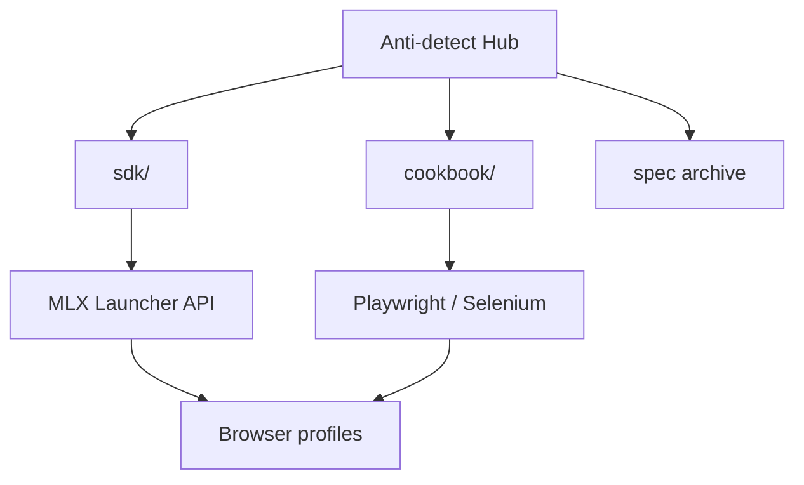

<!--
title: Anti-detect Browser & Multilogin X — 日本語ドキュメント
description: Anti-detect browser & fingerprinting hub: 無料で始める。12のAPIレシピ、Cloud Real Phone、Playwright/Selenium SDK。
keywords: アンチディテクトブラウザ, Multilogin X, 無料プラン, Cloud Real Phone, MIN50, SAAS50, ブラウザフィンガープリント, Playwright, MMO
homepage: https://multilogin.com/pricing/?utm_source=saas&utm_medium=partner&a_aid=saas&a_bid=f5fad549
lang: ja
-->

# Anti-detect Browser · Fingerprinting · Multilogin X

**自己完結型ハブ** — **アンチディテクトブラウザ**、**ブラウザフィンガープリント**、**Multilogin X (MLX)** API 自動化、**Playwright / Selenium** ステルスワークフロー。

SDK、API cookbook、ガイド、Postman アーカイブ — **すべてこのリポジトリに**。

> **Multilogin X:** [無料で始める、または月額$7.08からの有料プラン](https://multilogin.com/pricing/?utm_source=saas&utm_medium=partner&a_aid=saas&a_bid=f5fad549) · **`SAAS50`** (プロモコード) · **`MIN50`** (Cloud Real Phone)）

<p align="left">
  <a href="https://multilogin.com/pricing/?utm_source=saas&utm_medium=partner&a_aid=saas&a_bid=f5fad549"></a>
</p>

<p align="left">
  
  
  <a href="README.md"></a>
  <a href="README.vi.md"></a>
  <a href="README.zh-CN.md"></a>
  <a href="README.ru.md"></a>
  <a href="README.id.md"></a>
  <a href="README.pt-BR.md"></a>
  <a href="README.ko.md"></a>
  <a href="README.ja.md"></a>
  <a href="README.th.md"></a>
  <a href="README.es.md"></a>
  <a href="LICENSE"></a>
  <a href="SECURITY.md"></a>
</p>

<p align="left">
  
  
  
</p>

## 目次

- [GitHub #1 の理由](#github-1-の-multilogin-自動化ハブ)
- [このリポジトリについて](#このリポジトリについて)
- [Cloud Real Phone (MIN50)](#multilogin-cloud-real-phone)
- [クイックスタート](#クイックスタート)
- [SDK & API cookbook](#multilogin-x-sdk--api-cookbook)
- [比較 & 選択](#比較--選択)
- [ドキュメント](#ドキュメント)
- [FAQ](#よくある質問)
- [料金](#multilogin-料金)
- [言語](#言語)

---

## GitHub #1 の Multilogin 自動化ハブ

| | このハブ |
|---|----------|
| **レシピ** | **12** cookbook + 実行可能 Python |
| **CLI** | `mlx start` · `stop` · `profiles export` · `doctor` |
| **SDK** | Python, C#, Java, Node, cURL |
| **Cloud** | `profile/search`、トークン更新、worker シャーディング |
| **Mobile** | [Cloud Real Phone](docs/multilogin-cloud-real-phone.md) + **`MIN50`** |
| **言語** | 10 言語 README |
| **比較** | vs [GoLogin](docs/comparison-multilogin-vs-gologin.md)、[AdsPower](docs/comparison-multilogin-vs-adspower.md) |

詳細: [docs/why-this-hub.md](docs/why-this-hub.md)

---

## このリポジトリについて

[@Anti-detect](https://github.com/Anti-detect) 公式 **GitHub プロフィール README** — **ドキュメント + SDK ハブ** (MIT):

- **アンチディテクトブラウザ** / フィンガープリント分離
- **Multilogin X** Local Launcher API（start, stop, quick profile）
- **実行可能コード** [`sdk/`](sdk/) — Python, C#, Java, Node, cURL
- **実践レシピ** [docs/multilogin-api/cookbook/](docs/multilogin-api/cookbook/)
- **Postman アーカイブ** [docs/multilogin-api/spec/](docs/multilogin-api/spec/)

| 対象 | ユースケース |
|------|-------------|
| 自動化エンジニア | Playwright / Selenium で MLX 接続 |
| MMO & growth チーム | マルチアカウント分離 + ローテーション |
| 開発者 | API リファレンス、SDK、スモークテスト |
| Mobile / MMO | [Cloud Real Phone](docs/multilogin-cloud-real-phone.md) + desktop fleet |

---

## Multilogin Cloud Real Phone

**クラウド上の実 Android 端末** — デスクトップ自動化を罰するプラットフォーム向けの本物のモバイルフィンガープリント。

| | |
|---|---|
| **ガイド** | [docs/multilogin-cloud-real-phone.md](docs/multilogin-cloud-real-phone.md) |
| **Mobile MMO** | [docs/mobile-mmo-playbook.md](docs/mobile-mmo-playbook.md) |
| **プロモ** | **`MIN50`** — [Multilogin 料金](https://multilogin.com/pricing/?utm_source=saas&utm_medium=partner&a_aid=saas&a_bid=f5fad549) |

デスクトップは Launcher API（[cookbook](docs/multilogin-api/cookbook/)）、モバイルは Cloud Real Phone — 同じ workspace ルール。

---

## クイックスタート

| 手順 | 操作 |
|------|------|
| 1 | Multilogin X をインストールしブラウザプロファイルを作成 |
| 2 | folder/profile UUID → [docs/token-and-ids.md](docs/token-and-ids.md) |
| 3 | `cp sdk/config.example.env sdk/.env` に ID を入力 |
| 4 | `cd sdk/python && pip install -e .`（`mlx` CLI） |
| 5 | `mlx doctor` → `mlx start` または [`recipes/01`](sdk/python/recipes/01_saved_profile_lifecycle.py) |
| 6 | Mobile → [Cloud Real Phone](docs/multilogin-cloud-real-phone.md) · **`MIN50`** |
| 7 | Desktop → [料金](https://multilogin.com/pricing/?utm_source=saas&utm_medium=partner&a_aid=saas&a_bid=f5fad549) · **`SAAS50`** |

完全版: [docs/getting-started.md](docs/getting-started.md)

---

## Multilogin X SDK & API cookbook

| 層 | リンク |
|----|--------|
| **SDK** | [`sdk/`](sdk/) — `mlx_client`, start/stop/quick |
| **Cookbook** | [docs/multilogin-api/cookbook/](docs/multilogin-api/cookbook/) — **12** レシピ |
| **Cloud API** | [docs/multilogin-api/cloud-api.md](docs/multilogin-api/cloud-api.md) · `mlx profiles export` |
| **API リファレンス** | [docs/multilogin-api/](docs/multilogin-api/) |
| **Postman** | [docs/multilogin-api/spec/](docs/multilogin-api/spec/) |
| **ライブラリマップ** | [docs/libraries.md](docs/libraries.md) |

```text
sdk/python/
├── mlx_client.py          # 再利用可能 Launcher クライアント
├── mlx_helpers.py         # CDP URL, quick v3, retry
├── automation_patterns.py # login + Playwright/Selenium attach
└── recipes/               # 12 フロー: lifecycle, rotation, cloud export
```

| # | レシピ | シナリオ |
|---|--------|----------|
| 01–05 | Lifecycle → smoke | コア Launcher + CI |
| 06 | Retry | 一時的 Launcher エラー |
| 07–08 | Login, Selenium | 本番 attach |
| 09–11 | Cookie | warm, export, import |
| 12 | Cloud + workers | `profiles.json` + sharding |

Postman: [Postman コレクション](https://documenter.getpostman.com/view/28533318/2s946h9Cv9)

---

**さらにプロファイルが必要ですか？** [Multilogin pricing (無料プランあり)](https://multilogin.com/pricing/?utm_source=saas&utm_medium=partner&a_aid=saas&a_bid=f5fad549) — 月額$7.08から。チェックアウト時に **`SAAS50`** または **`MIN50`** を使用。

---

## アーキテクチャ



詳細: [docs/architecture.md](docs/architecture.md)

---

## 比較 & 選択

| ドキュメント | 検索意図 |
|-------------|----------|
| [vs GoLogin](docs/comparison-multilogin-vs-gologin.md) | Multilogin 代替 |
| [vs AdsPower](docs/comparison-multilogin-vs-adspower.md) | AdsPower 代替 |
| [vs Chrome](docs/comparison-anti-detect-vs-chrome.md) | anti-detect の理由 |
| [Use cases](docs/use-cases.md) | 業界別 |
| [Why this hub](docs/why-this-hub.md) | #1 open MLX ハブ |

---

## ガイド

| トピック | ドキュメント |
|----------|-------------|
| Cloud Real Phone | [docs/multilogin-cloud-real-phone.md](docs/multilogin-cloud-real-phone.md) |
| Playwright + MLX | [docs/playwright-mlx-integration.md](docs/playwright-mlx-integration.md) |
| MMO / マルチアカウント | [docs/mmo-automation-guide.md](docs/mmo-automation-guide.md) |
| Mobile MMO | [docs/mobile-mmo-playbook.md](docs/mobile-mmo-playbook.md) |
| トラブルシュート | [docs/troubleshooting.md](docs/troubleshooting.md) |
| フィンガープリント QA | [docs/fingerprint-checklist.md](docs/fingerprint-checklist.md) |
| 市場概要 | [docs/browser-landscape.md](docs/browser-landscape.md) |

---

## よくある質問

### アンチディテクトブラウザとは？

フィンガープリント、ストレージ、プロキシを分離し、各プロファイルを別デバイスのように見せるソフトウェア。

### コードはどこ？

この repo: [`sdk/`](sdk/) と [cookbook](docs/multilogin-api/cookbook/)。

### プロファイル ID の取得方法は？

[docs/token-and-ids.md](docs/token-and-ids.md)

### Multilogin X の割引は？

[Multilogin 料金](https://multilogin.com/pricing/?utm_source=saas&utm_medium=partner&a_aid=saas&a_bid=f5fad549)で **`SAAS50`** または **`MIN50`**。

詳細: [docs/faq.md](docs/faq.md)

---

## Multilogin 料金

| プラン | 詳細 |
|--------|------|
| **無料プラン** | 5プロファイル + 200MBプロキシ + 1クラウドモバイルプロファイル(30分)。**時間制限なし、クレジットカード不要。** |
| **有料プラン** | 月額 **$7.08から**。API自動化、プロキシトラフィック、モバイル分数、チーム機能が含まれます。 |

| コード | 内容 | いつ使うか |
|--------|------|------------|
| **`SAAS50`** | Multilogin プロモコード | 新しいMLXプラン、初回購入 |
| **`MIN50`** | Multilogin Cloud Real Phone | Cloud Real Phone / エントリー |

**チェックアウト:** [Multilogin pricing](https://multilogin.com/pricing/?utm_source=saas&utm_medium=partner&a_aid=saas&a_bid=f5fad549) · [docs/urls.md](docs/urls.md) · [pricing-cta.md](docs/pricing-cta.md)

---

## 言語

| 言語 | README |
|------|--------|
| English | [README.md](README.md) |
| Tiếng Việt | [README.vi.md](README.vi.md) |
| 中文 | [README.zh-CN.md](README.zh-CN.md) |
| Русский | [README.ru.md](README.ru.md) |
| Indonesia | [README.id.md](README.id.md) |
| Português (BR) | [README.pt-BR.md](README.pt-BR.md) |
| 한국어 | [README.ko.md](README.ko.md) |
| 日本語 | このページ |
| ไทย | [README.th.md](README.th.md) |
| Español | [README.es.md](README.es.md) |

[索引](docs/locales.md)

---

## ドキュメント

| ドキュメント | 用途 |
|-------------|------|
| [docs/README.md](docs/README.md) | ドキュメント索引 |
| [docs/getting-started.md](docs/getting-started.md) | オンボーディング |
| [docs/multilogin-cloud-real-phone.md](docs/multilogin-cloud-real-phone.md) | Cloud Real Phone + MIN50 |
| [docs/troubleshooting.md](docs/troubleshooting.md) | Launcher/CDP/cloud 修正 |
| [docs/repository-map.md](docs/repository-map.md) | リポジトリ構成 |
| [docs/token-and-ids.md](docs/token-and-ids.md) | UUID & トークン |
| [docs/architecture.md](docs/architecture.md) | アーキテクチャ |
| [docs/multilogin-api/cookbook/](docs/multilogin-api/cookbook/) | API レシピ |
| [sdk/README.md](sdk/README.md) | SDK |
| [docs/maintenance.md](docs/maintenance.md) | メンテナンス |
| [docs/disclaimer.md](docs/disclaimer.md) | 免責事項 |
| [CONTRIBUTING.md](CONTRIBUTING.md) | 貢献 |
| [SECURITY.md](SECURITY.md) | セキュリティ |
| [docs/pricing-cta.md](docs/pricing-cta.md) | アフィリエイト CTA（**SAAS50** / **MIN50**） |

---

<p align="center">
  <strong><a href="https://multilogin.com/pricing/?utm_source=saas&utm_medium=partner&a_aid=saas&a_bid=f5fad549">Multilogin X を無料で始める</a></strong> — 有料プランは月額$7.08から · <code>SAAS50</code> · <code>MIN50</code> (Cloud Real Phone)
</p>

<p align="center">
  <sub>Anti-detect browser · Browser fingerprinting · Multilogin X · Playwright · Selenium</sub>
</p>
