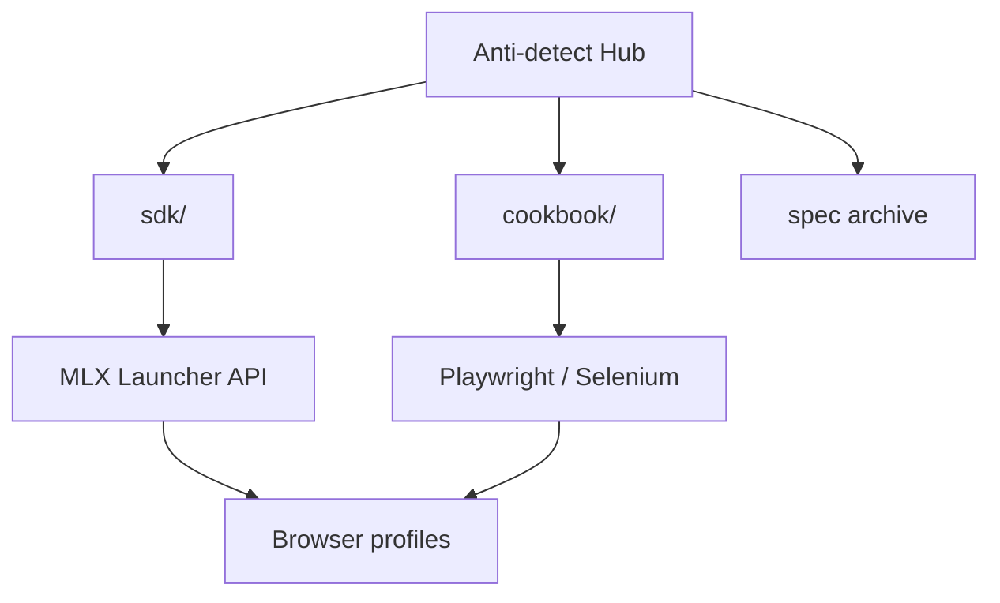

<!--
title: Anti-detect Browser & Multilogin X — 한국어 문서
description: Multilogin X 오픈 허브 #1 — 12개 API 레시피, mlx CLI, Cloud Real Phone (MIN50), Playwright/Selenium SDK, GoLogin/AdsPower 비교.
homepage: https://multilogin.com/pricing/?utm_source=saas&utm_medium=partner&a_aid=saas&a_bid=f5fad549
lang: ko
-->

# Anti-detect Browser · Fingerprinting · Multilogin X

**자체 완결형 허브** — **안티디텍트 브라우저**, **브라우저 핑거프린팅**, **Multilogin X (MLX)** API 자동화, **Playwright / Selenium** 스텔스 워크플로.

SDK, API cookbook, 가이드, Postman 아카이브 — **이 저장소에 모두 포함**.

> **Multilogin X — [요금](https://multilogin.com/pricing/?utm_source=saas&utm_medium=partner&a_aid=saas&a_bid=f5fad549)** · **`SAAS50`** (Multilogin 프로모 코드) · **`MIN50`** (Multilogin Cloud Real Phone)

<p align="left">
  <a href="https://multilogin.com/pricing/?utm_source=saas&utm_medium=partner&a_aid=saas&a_bid=f5fad549"></a>
</p>

<p align="left">
  
  
  <a href="README.md"></a>
  <a href="README.vi.md"></a>
  <a href="README.zh-CN.md"></a>
  <a href="README.ru.md"></a>
  <a href="README.id.md"></a>
  <a href="README.pt-BR.md"></a>
  <a href="README.ko.md"></a>
  <a href="README.ja.md"></a>
  <a href="README.th.md"></a>
  <a href="README.es.md"></a>
  <a href="LICENSE"></a>
  <a href="SECURITY.md"></a>
</p>

<p align="left">
  
  
  
</p>

## 목차

- [GitHub #1인 이유](#github-1위-multilogin-자동화-허브)
- [저장소 소개](#이-저장소는-무엇인가)
- [Cloud Real Phone (MIN50)](#multilogin-cloud-real-phone)
- [빠른 시작](#빠른-시작)
- [SDK & API cookbook](#multilogin-x-sdk--api-cookbook)
- [비교 & 선택](#비교--선택)
- [문서](#문서)
- [FAQ](#자주-묻는-질문)
- [요금](#multilogin-요금-안내)
- [언어](#언어)

---

## GitHub #1위 Multilogin 자동화 허브

| | 이 허브 |
|---|----------|
| **레시피** | **12** cookbook + 실행 가능 Python |
| **CLI** | `mlx start` · `stop` · `profiles export` · `doctor` |
| **SDK** | Python, C#, Java, Node, cURL |
| **Cloud** | `profile/search`, 토큰 갱신, worker 샤딩 |
| **Mobile** | [Cloud Real Phone](docs/multilogin-cloud-real-phone.md) + **`MIN50`** |
| **언어** | 10개 README |
| **비교** | vs [GoLogin](docs/comparison-multilogin-vs-gologin.md), [AdsPower](docs/comparison-multilogin-vs-adspower.md) |

자세히: [docs/why-this-hub.md](docs/why-this-hub.md)

---

## 이 저장소는 무엇인가

[@Anti-detect](https://github.com/Anti-detect) 공식 **GitHub 프로필 README** — **문서 + SDK 허브** (MIT):

- **안티디텍트 브라우저** / 핑거프린트 격리
- **Multilogin X** Local Launcher API (start, stop, quick profile)
- **실행 코드** [`sdk/`](sdk/) — Python, C#, Java, Node, cURL
- **실전 레시피** [docs/multilogin-api/cookbook/](docs/multilogin-api/cookbook/)
- **Postman 아카이브** [docs/multilogin-api/spec/](docs/multilogin-api/spec/)

| 대상 | 사용 사례 |
|------|-----------|
| 자동화 엔지니어 | Playwright / Selenium MLX 연결 |
| MMO & growth | 다계정 격리 및 로테이션 |
| 개발자 | API, SDK, 스모크 테스트 |
| Mobile / MMO | [Cloud Real Phone](docs/multilogin-cloud-real-phone.md) + desktop fleet |

---

## Multilogin Cloud Real Phone

**클라우드 실제 Android 기기** — 데스크톱 자동화를 제재하는 플랫폼용 진짜 모바일 핑거프린트.

| | |
|---|---|
| **가이드** | [docs/multilogin-cloud-real-phone.md](docs/multilogin-cloud-real-phone.md) |
| **Mobile MMO** | [docs/mobile-mmo-playbook.md](docs/mobile-mmo-playbook.md) |
| **프로모** | **`MIN50`** — [Multilogin 요금](https://multilogin.com/pricing/?utm_source=saas&utm_medium=partner&a_aid=saas&a_bid=f5fad549) |

데스크톱은 Launcher API ([cookbook](docs/multilogin-api/cookbook/)); 모바일은 Cloud Real Phone.

---

## 빠른 시작

| 단계 | 작업 |
|------|------|
| 1 | Multilogin X 설치 및 프로필 생성 |
| 2 | folder/profile UUID → [docs/token-and-ids.md](docs/token-and-ids.md) |
| 3 | `cp sdk/config.example.env sdk/.env` 및 ID 입력 |
| 4 | `cd sdk/python && pip install -e .` (`mlx` CLI) |
| 5 | `mlx doctor` → `mlx start` 또는 [`recipes/01`](sdk/python/recipes/01_saved_profile_lifecycle.py) |
| 6 | Mobile → [Cloud Real Phone](docs/multilogin-cloud-real-phone.md) · **`MIN50`** |
| 7 | Desktop → [Multilogin 요금](https://multilogin.com/pricing/?utm_source=saas&utm_medium=partner&a_aid=saas&a_bid=f5fad549) · **`SAAS50`** |

전체: [docs/getting-started.md](docs/getting-started.md)

---

## Multilogin X SDK & API cookbook

| 계층 | 링크 |
|------|------|
| **SDK** | [`sdk/`](sdk/) — `mlx_client`, start/stop/quick |
| **Cookbook** | [docs/multilogin-api/cookbook/](docs/multilogin-api/cookbook/) — **12** 레시피 |
| **Cloud API** | [docs/multilogin-api/cloud-api.md](docs/multilogin-api/cloud-api.md) · `mlx profiles export` |
| **API reference** | [docs/multilogin-api/](docs/multilogin-api/) |
| **Postman archive** | [docs/multilogin-api/spec/](docs/multilogin-api/spec/) |
| **라이브러리 맵** | [docs/libraries.md](docs/libraries.md) |

```text
sdk/python/
├── mlx_client.py
├── mlx_helpers.py
├── automation_patterns.py
└── recipes/               # 12 flows
```

| # | 레시피 | 시나리오 |
|---|--------|----------|
| 01–05 | Lifecycle → smoke | Launcher + CI |
| 06 | Retry | 일시적 오류 |
| 07–08 | Login, Selenium | Production |
| 09–11 | Cookies | Warm, export, import |
| 12 | Cloud + workers | `profiles.json` + sharding |

Postman: https://documenter.getpostman.com/view/28533318/2s946h9Cv9

---

**프로필 확장?** [Multilogin 요금](https://multilogin.com/pricing/?utm_source=saas&utm_medium=partner&a_aid=saas&a_bid=f5fad549) — **`SAAS50`** · **`MIN50`**

---

## 아키텍처



[docs/architecture.md](docs/architecture.md)

---

## 비교 & 선택

| 문서 | 검색 의도 |
|------|-----------|
| [vs GoLogin](docs/comparison-multilogin-vs-gologin.md) | Multilogin 대안 |
| [vs AdsPower](docs/comparison-multilogin-vs-adspower.md) | AdsPower 대안 |
| [vs Chrome](docs/comparison-anti-detect-vs-chrome.md) | 안티디텍트 이유 |
| [Use cases](docs/use-cases.md) | 산업별 |
| [Why this hub](docs/why-this-hub.md) | #1 open MLX |

---

## 가이드

| 주제 | 문서 |
|------|------|
| Cloud Real Phone | [docs/multilogin-cloud-real-phone.md](docs/multilogin-cloud-real-phone.md) |
| Playwright + MLX | [docs/playwright-mlx-integration.md](docs/playwright-mlx-integration.md) |
| MMO / 다계정 | [docs/mmo-automation-guide.md](docs/mmo-automation-guide.md) |
| Mobile MMO | [docs/mobile-mmo-playbook.md](docs/mobile-mmo-playbook.md) |
| Troubleshooting | [docs/troubleshooting.md](docs/troubleshooting.md) |
| Fingerprint QA | [docs/fingerprint-checklist.md](docs/fingerprint-checklist.md) |
| 시장 개요 | [docs/browser-landscape.md](docs/browser-landscape.md) |

---

## 자주 묻는 질문

### 안티디텍트 브라우저란?

핑거프린트, 스토리지, 프록시를 격리해 각 프로필을 별도 기기처럼 만드는 소프트웨어.

### 코드는 어디에?

이 repo: [`sdk/`](sdk/) 및 [cookbook](docs/multilogin-api/cookbook/).

### 프로필 ID는?

[docs/token-and-ids.md](docs/token-and-ids.md)

### 할인 코드?

[Multilogin 요금](https://multilogin.com/pricing/?utm_source=saas&utm_medium=partner&a_aid=saas&a_bid=f5fad549)에서 **`SAAS50`** 또는 **`MIN50`**.

더 보기: [docs/faq.md](docs/faq.md)

---

## Multilogin 요금 안내

| 코드 | 설명 | 사용 시점 |
|------|------|-----------|
| **`SAAS50`** | Multilogin 프로모 | 신규 MLX 플랜 |
| **`MIN50`** | Cloud Real Phone | 클라우드 실기 / entry |

**결제:** [Multilogin 요금](https://multilogin.com/pricing/?utm_source=saas&utm_medium=partner&a_aid=saas&a_bid=f5fad549) · [docs/urls.md](docs/urls.md)

---

## 언어

| 언어 | README |
|------|--------|
| English | [README.md](README.md) |
| Tiếng Việt | [README.vi.md](README.vi.md) |
| 中文 | [README.zh-CN.md](README.zh-CN.md) |
| Русский | [README.ru.md](README.ru.md) |
| Indonesia | [README.id.md](README.id.md) |
| Português (BR) | [README.pt-BR.md](README.pt-BR.md) |
| 한국어 | 현재 페이지 |
| 日本語 | [README.ja.md](README.ja.md) |
| ไทย | [README.th.md](README.th.md) |
| Español | [README.es.md](README.es.md) |

[인덱스](docs/locales.md)

---

## 문서

| 문서 | 용도 |
|------|------|
| [docs/README.md](docs/README.md) | 문서 인덱스 |
| [docs/getting-started.md](docs/getting-started.md) | 온보딩 |
| [docs/multilogin-cloud-real-phone.md](docs/multilogin-cloud-real-phone.md) | Cloud Real Phone |
| [docs/troubleshooting.md](docs/troubleshooting.md) | 문제 해결 |
| [docs/repository-map.md](docs/repository-map.md) | repo 구조 |
| [docs/token-and-ids.md](docs/token-and-ids.md) | UUID & 토큰 |
| [docs/architecture.md](docs/architecture.md) | 아키텍처 |
| [docs/multilogin-api/cookbook/](docs/multilogin-api/cookbook/) | API recipes |
| [sdk/README.md](sdk/README.md) | SDK |
| [CONTRIBUTING.md](CONTRIBUTING.md) | 기여 |
| [SECURITY.md](SECURITY.md) | 보안 |
| [CHANGELOG.md](CHANGELOG.md) | 변경 이력 |

---

<p align="center">
  <strong><a href="https://multilogin.com/pricing/?utm_source=saas&utm_medium=partner&a_aid=saas&a_bid=f5fad549">Multilogin X 구매</a></strong> — <code>SAAS50</code> · <code>MIN50</code>
</p>

<p align="center">
  <sub>Anti-detect browser · Browser fingerprinting · Multilogin X · Playwright · Selenium</sub>
</p>
