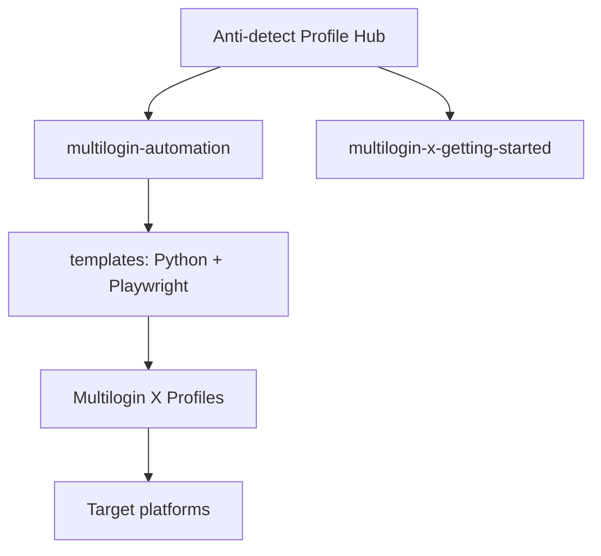

<!--
title: Anti-detect Browser Automation & Multilogin X Documentation
description: Anti-detect browser, browser fingerprinting, Multilogin X automation, stealth Playwright and Selenium templates — open documentation hub.
keywords: anti-detect browser, antidetect browser, fingerprint browser, Multilogin X, GoLogin, Dolphin Anty, AdsPower, browser profile manager, stealth automation, Playwright, Selenium, MMO
homepage: https://multilogin.com/pricing/?utm_source=saas&utm_medium=partner&a_aid=saas&a_bid=f5fad549
author: Anti-detect
-->

# Anti-detect Browser · Fingerprinting · Multilogin X Automation

**Open documentation hub** for **anti-detect browser** engineering, **browser fingerprinting**, **Multilogin X (MLX)** workflows, and **stealth automation** (Playwright, Selenium, Python). Curated links to verified kits under [@multilogin-automation](https://github.com/multilogin-automation).

<p align="left">
  
  
  <a href="README.vi.md"></a>
  <a href="README.zh-CN.md"></a>
  <a href="README.ru.md"></a>
  <a href="README.id.md"></a>
  <a href="README.pt-BR.md"></a>
  <a href="README.ko.md"></a>
  <a href="README.ja.md"></a>
  <a href="README.th.md"></a>
  <a href="README.es.md"></a>
  <a href="LICENSE"></a>
  <a href="SECURITY.md"></a>
  <a href="https://github.com/multilogin-automation/multilogin-automation"></a>
</p>

<p align="left">
  
  
  
</p>

## Table of contents

- [What is this repository?](#what-is-this-repository)
- [Who is this for?](#who-is-this-for)
- [Key capabilities](#key-capabilities)
- [Architecture](#architecture)
- [Quick start](#quick-start)
- [Open-source dev kits](#open-source-dev-kits)
- [Why browser fingerprinting matters](#why-browser-fingerprinting-matters)
- [Anti-detect browser landscape](#anti-detect-browser-landscape)
- [MMO & multi-account guide](#mmo--multi-account-guide)
- [FAQ](#frequently-asked-questions)
- [Multilogin pricing reference](#multilogin-pricing-reference)
- [Languages](#languages)
- [Repository settings (SEO)](#repository-settings-seo)
- [Documentation](#documentation)

---

## What is this repository?

Official **GitHub profile README** for [@Anti-detect](https://github.com/Anti-detect): a neutral **discovery hub** for:

- **Anti-detect browser** / **antidetect browser** patterns  
- **Fingerprint browser** isolation (Canvas, WebGL, fonts, AudioContext)  
- **Multilogin X** API and local launcher integration  
- **Browser profile manager** workflows for multi-account automation  
- **Stealth Playwright** and **Selenium fingerprint** templates  

Implementation code lives in separate open-source repositories; **this repo is documentation only** (MIT), which keeps installs small and issues focused.

## Who is this for?

| Audience | Use case |
|----------|----------|
| Automation engineers | Scale UI jobs with isolated fingerprints |
| MMO & growth teams | Multi-account ops with profile separation |
| Agencies | MLX / anti-detect delivery playbooks |
| Developers | Evaluate kits before production spend |

---

## Key capabilities

| Area | Deliverable |
|------|-------------|
| **Browser fingerprinting** | Per-profile UA, Canvas, WebGL, AudioContext, fonts |
| **Human-like behavior** | Mouse curves, typing variance, session timing |
| **Multilogin X** | API + local launcher patterns, token/profile tooling |
| **Open source** | Verified repos + `/templates` in `multilogin-automation` |
| **Education** | Architecture, glossary, Chrome vs anti-detect comparison |

---

## Architecture



Details: [docs/architecture.md](docs/architecture.md) · [docs/comparison-anti-detect-vs-chrome.md](docs/comparison-anti-detect-vs-chrome.md)

---

## Quick start

| Step | Action |
|------|--------|
| 1 | New to MLX → [multilogin-x-getting-started](https://github.com/multilogin-automation/multilogin-x-getting-started) |
| 2 | Tokens & IDs → [multilogin-x-id-token-retrieval-tools](https://github.com/multilogin-automation/multilogin-x-id-token-retrieval-tools) |
| 3 | Code templates → [`multilogin-automation/templates`](https://github.com/multilogin-automation/multilogin-automation/tree/main/templates) |
| 4 | Commercial MLX plans → [Multilogin pricing](https://multilogin.com/pricing/?utm_source=saas&utm_medium=partner&a_aid=saas&a_bid=f5fad549) · codes **`SAAS50`** / **`MIN50`** |
| 5 | Fingerprint QA → [fingerprint-checklist.md](docs/fingerprint-checklist.md) |

Full paths: [docs/getting-started.md](docs/getting-started.md)

---

## Open-source dev kits

Verified repositories (see [docs/open-source-catalog.md](docs/open-source-catalog.md)):

| Priority | Repository | Description |
|----------|------------|-------------|
| ⭐ | [multilogin-automation](https://github.com/multilogin-automation/multilogin-automation) | Master hub + Playwright/Python templates |
| 🚀 | [multilogin-x-getting-started](https://github.com/multilogin-automation/multilogin-x-getting-started) | MLX onboarding |
| 🔑 | [multilogin-x-id-token-retrieval-tools](https://github.com/multilogin-automation/multilogin-x-id-token-retrieval-tools) | Tokens, profile & workspace IDs |
| 🍪 | [multilogin_x_auto_cookie_collector](https://github.com/multilogin-automation/multilogin_x_auto_cookie_collector) | Cookie warming |
| 🛡️ | [undetectable-fingerprint-browser](https://github.com/multilogin-automation/undetectable-fingerprint-browser) | OSS fingerprint / anti-detect patterns |

**Templates (in-repo):**

- [`mlx_config_template.py`](https://github.com/multilogin-automation/multilogin-automation/blob/main/templates/mlx_config_template.py) — MLX API boilerplate  
- [`playwright_stealth.py`](https://github.com/multilogin-automation/multilogin-automation/blob/main/templates/playwright_stealth.py) — Playwright stealth hooks  

---

## Why browser fingerprinting matters

Sites combine **TLS**, **IP reputation**, **JS challenges**, and **browser fingerprint** clusters. One shared Canvas hash or WebGL renderer across accounts can flag an entire fleet.

**Anti-detect profiles** align fingerprint, behavior, and network context per session—especially on **Multilogin X**-class **undetectable browser** stacks.

---

## Anti-detect browser landscape

Neutral overview of how **Multilogin X** fits next to other common search terms (**GoLogin**, **Dolphin Anty**, **AdsPower**, **Incogniton**, OSS profile managers):

**[docs/browser-landscape.md](docs/browser-landscape.md)**

---

## MMO & multi-account guide

Playbook for **MMO automation** and **multi-account browser** isolation on MLX:

**[docs/mmo-automation-guide.md](docs/mmo-automation-guide.md)** · Playwright attach flow: **[docs/playwright-mlx-integration.md](docs/playwright-mlx-integration.md)**

---

## Frequently asked questions

### What is an anti-detect browser?

Software that isolates fingerprints, storage, and proxies so each profile resembles a separate device—common for QA, **stealth automation**, and **multi-account browser** workflows.

### Where is the Playwright / Python / Selenium code?

In [@multilogin-automation](https://github.com/multilogin-automation), especially [`multilogin-automation/templates`](https://github.com/multilogin-automation/multilogin-automation/tree/main/templates).

### How do I get a discount on Multilogin X?

Use **`SAAS50`** or **`MIN50`** on [Multilogin pricing](https://multilogin.com/pricing/?utm_source=saas&utm_medium=partner&a_aid=saas&a_bid=f5fad549) (see [pricing reference](#multilogin-pricing-reference)).

### How do I report security issues?

[SECURITY.md](SECURITY.md) — use private reporting; no public issues for sensitive reports.

More: [docs/faq.md](docs/faq.md) · localized READMEs linked above.

---

## Multilogin pricing reference

| Code | Typical use |
|------|-------------|
| **`SAAS50`** | First-time / SaaS partner discount on Multilogin X |
| **`MIN50`** | Minimum-tier or follow-up offers (see checkout) |

**Checkout:** [multilogin.com/pricing](https://multilogin.com/pricing/?utm_source=saas&utm_medium=partner&a_aid=saas&a_bid=f5fad549)

Maintainers: canonical URL in [docs/urls.md](docs/urls.md).

---

## Languages

| Locale | README |
|--------|--------|
| English | You are here |
| Tiếng Việt | [README.vi.md](README.vi.md) |
| 中文 | [README.zh-CN.md](README.zh-CN.md) |
| Русский | [README.ru.md](README.ru.md) |
| Indonesia | [README.id.md](README.id.md) |
| Português (BR) | [README.pt-BR.md](README.pt-BR.md) |
| 한국어 | [README.ko.md](README.ko.md) |
| 日本語 | [README.ja.md](README.ja.md) |
| ไทย | [README.th.md](README.th.md) |
| Español | [README.es.md](README.es.md) |

Full index: [docs/locales.md](docs/locales.md)

---

## Repository settings (SEO)

Metadata: [`.github/repo-metadata.json`](.github/repo-metadata.json). After adding **`GH_METADATA_TOKEN`**, [Sync repository settings](.github/workflows/sync-repo-settings.yml) applies topics on push. Setup: [docs/setup-github-metadata.md](docs/setup-github-metadata.md).

```powershell
$env:GITHUB_TOKEN = "ghp_YOUR_TOKEN"
.\scripts\set-github-about.ps1
```

**Once in GitHub UI:** [social preview + pinned repos](docs/github-profile-setup.md)

Target keywords: `anti-detect`, `browser-fingerprinting`, `multilogin-x`, `fingerprint-browser`, `browser-profiles`, `stealth`, `playwright`, `selenium`, `mmo`.

---

## Documentation

| Doc | Purpose |
|-----|---------|
| [docs/README.md](docs/README.md) | Documentation index |
| [docs/getting-started.md](docs/getting-started.md) | Onboarding |
| [docs/open-source-catalog.md](docs/open-source-catalog.md) | All verified repos |
| [docs/architecture.md](docs/architecture.md) | System design |
| [docs/glossary.md](docs/glossary.md) | Terminology (EN + more) |
| [docs/browser-landscape.md](docs/browser-landscape.md) | Neutral market / keyword map |
| [docs/fingerprint-checklist.md](docs/fingerprint-checklist.md) | Pre-flight fingerprint QA |
| [docs/mmo-automation-guide.md](docs/mmo-automation-guide.md) | MMO / multi-account patterns |
| [docs/playwright-mlx-integration.md](docs/playwright-mlx-integration.md) | Playwright + MLX attach |
| [docs/locales.md](docs/locales.md) | Localized README index |
| [docs/urls.md](docs/urls.md) | Canonical pricing URL & codes |
| [docs/seo-checklist.md](docs/seo-checklist.md) | Maintainer SEO |
| [SUPPORT.md](SUPPORT.md) | Support routing |
| [CHANGELOG.md](CHANGELOG.md) | Change history |
| [CONTRIBUTING.md](CONTRIBUTING.md) | Contribute |
| [SECURITY.md](SECURITY.md) | Security |

---

<p align="center">
  <a href="https://github.com/multilogin-automation/multilogin-automation/stargazers">
    
  </a>
</p>

<p align="center">
  <sub>Anti-detect browser · Browser fingerprinting · Multilogin X · Playwright · Selenium</sub>
</p>
