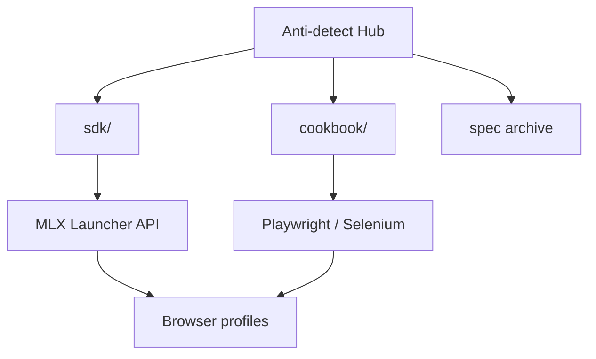

<!--
title: Anti-detect Browser Automation & Multilogin X Documentation
description: Anti-detect browser, browser fingerprinting, Multilogin X API SDK, stealth Playwright and Selenium recipes — self-contained documentation hub.
keywords: anti-detect browser, antidetect browser, fingerprint browser, Multilogin X, browser profile manager, stealth automation, Playwright, Selenium, MMO
homepage: https://multilogin.com/pricing/?utm_source=saas&utm_medium=partner&a_aid=saas&a_bid=f5fad549
author: Anti-detect
-->

# Anti-detect Browser · Fingerprinting · Multilogin X

**Self-contained hub** for **anti-detect browser** engineering, **browser fingerprinting**, **Multilogin X (MLX)** API automation, and **stealth Playwright / Selenium** workflows.

Everything you need — SDK, API cookbook, guides, and Postman archive — lives **in this repository**.

<p align="left">
  
  
  <a href="README.vi.md"></a>
  <a href="README.zh-CN.md"></a>
  <a href="README.ru.md"></a>
  <a href="README.id.md"></a>
  <a href="README.pt-BR.md"></a>
  <a href="README.ko.md"></a>
  <a href="README.ja.md"></a>
  <a href="README.th.md"></a>
  <a href="README.es.md"></a>
  <a href="LICENSE"></a>
  <a href="SECURITY.md"></a>
</p>

<p align="left">
  
  
  
</p>

## Table of contents

- [What is this repository?](#what-is-this-repository)
- [Quick start](#quick-start)
- [SDK & API cookbook](#multilogin-x-sdk--api-cookbook)
- [Documentation map](#documentation)
- [FAQ](#frequently-asked-questions)
- [Multilogin pricing](#multilogin-pricing-reference)
- [Languages](#languages)

---

## What is this repository?

Official **GitHub profile README** for [@Anti-detect](https://github.com/Anti-detect): a **documentation + SDK hub** (MIT) covering:

- **Anti-detect browser** / fingerprint isolation patterns
- **Multilogin X** Local Launcher API (start, stop, quick profile)
- **Runnable code** in [`sdk/`](sdk/) — Python, C#, Java, Node, cURL
- **Real-world recipes** in [docs/multilogin-api/cookbook/](docs/multilogin-api/cookbook/)
- **Postman archive** in [docs/multilogin-api/spec/](docs/multilogin-api/spec/)

| Audience | Use case |
|----------|----------|
| Automation engineers | Playwright / Selenium attach to MLX profiles |
| MMO & growth teams | Multi-account isolation + rotation recipes |
| Developers | API reference, copy-paste SDK, smoke tests |

---

## Quick start

| Step | Action |
|------|--------|
| 1 | Install Multilogin X and create a browser profile |
| 2 | Get folder/profile UUIDs → [docs/token-and-ids.md](docs/token-and-ids.md) |
| 3 | `cp sdk/config.example.env sdk/.env` and fill IDs |
| 4 | `cd sdk/python && pip install -r requirements.txt` |
| 5 | Run [`sdk/python/recipes/01_saved_profile_lifecycle.py`](sdk/python/recipes/01_saved_profile_lifecycle.py) |
| 6 | MLX plans → [Multilogin pricing](https://multilogin.com/pricing/?utm_source=saas&utm_medium=partner&a_aid=saas&a_bid=f5fad549) · **`SAAS50`** / **`MIN50`** |

Full paths: [docs/getting-started.md](docs/getting-started.md)

---

## Multilogin X SDK & API cookbook

| Layer | Link |
|-------|------|
| **SDK** | [`sdk/`](sdk/) — `mlx_client`, start/stop/quick |
| **Cookbook** | [docs/multilogin-api/cookbook/](docs/multilogin-api/cookbook/) — 8 real-world recipes |
| **API reference** | [docs/multilogin-api/](docs/multilogin-api/) |
| **Postman archive** | [docs/multilogin-api/spec/](docs/multilogin-api/spec/) |
| **Library map** | [docs/libraries.md](docs/libraries.md) |

```text
sdk/python/
├── mlx_client.py          # reusable Launcher client
├── mlx_helpers.py         # CDP URL, quick v3 payload, retry
├── automation_patterns.py # login + Playwright/Selenium attach
└── recipes/               # lifecycle, Playwright, Selenium, login, rotation
```

Live Postman: https://documenter.getpostman.com/view/28533318/2s946h9Cv9

---

## Architecture



Details: [docs/architecture.md](docs/architecture.md)

---

## Guides

| Topic | Doc |
|-------|-----|
| Playwright + MLX | [docs/playwright-mlx-integration.md](docs/playwright-mlx-integration.md) |
| MMO / multi-account | [docs/mmo-automation-guide.md](docs/mmo-automation-guide.md) |
| Fingerprint QA | [docs/fingerprint-checklist.md](docs/fingerprint-checklist.md) |
| Market overview | [docs/browser-landscape.md](docs/browser-landscape.md) |

---

## Frequently asked questions

### What is an anti-detect browser?

Software that isolates fingerprints, storage, and proxies so each profile resembles a separate device.

### Where is the code?

In this repo: [`sdk/`](sdk/) and [cookbook recipes](docs/multilogin-api/cookbook/).

### How do I get profile IDs?

[docs/token-and-ids.md](docs/token-and-ids.md)

### Discount on Multilogin X?

**`SAAS50`** or **`MIN50`** on [Multilogin pricing](https://multilogin.com/pricing/?utm_source=saas&utm_medium=partner&a_aid=saas&a_bid=f5fad549).

More: [docs/faq.md](docs/faq.md)

---

## Multilogin pricing reference

| Code | Typical use |
|------|-------------|
| **`SAAS50`** | First-time / partner discount |
| **`MIN50`** | Minimum-tier offers |

**Checkout:** [multilogin.com/pricing](https://multilogin.com/pricing/?utm_source=saas&utm_medium=partner&a_aid=saas&a_bid=f5fad549) · [docs/urls.md](docs/urls.md)

---

## Languages

| Locale | README |
|--------|--------|
| English | You are here |
| Tiếng Việt | [README.vi.md](README.vi.md) |
| 中文 | [README.zh-CN.md](README.zh-CN.md) |
| Русский | [README.ru.md](README.ru.md) |
| Indonesia | [README.id.md](README.id.md) |
| Português (BR) | [README.pt-BR.md](README.pt-BR.md) |
| 한국어 | [README.ko.md](README.ko.md) |
| 日本語 | [README.ja.md](README.ja.md) |
| ไทย | [README.th.md](README.th.md) |
| Español | [README.es.md](README.es.md) |

[Index](docs/locales.md)

---

## Documentation

| Doc | Purpose |
|-----|---------|
| [docs/README.md](docs/README.md) | Documentation index |
| [docs/getting-started.md](docs/getting-started.md) | Onboarding paths |
| [docs/repository-map.md](docs/repository-map.md) | What's inside this repo |
| [docs/token-and-ids.md](docs/token-and-ids.md) | Profile UUIDs & tokens |
| [docs/architecture.md](docs/architecture.md) | System design |
| [docs/multilogin-api/cookbook/](docs/multilogin-api/cookbook/) | API recipes |
| [sdk/README.md](sdk/README.md) | SDK entry |
| [docs/maintenance.md](docs/maintenance.md) | Maintainer workflow |
| [docs/disclaimer.md](docs/disclaimer.md) | Legal disclaimer |
| [CONTRIBUTING.md](CONTRIBUTING.md) | Contribute |
| [SECURITY.md](SECURITY.md) | Security |
| [CHANGELOG.md](CHANGELOG.md) | History |

---

<p align="center">
  <sub>Anti-detect browser · Browser fingerprinting · Multilogin X · Playwright · Selenium</sub>
</p>
