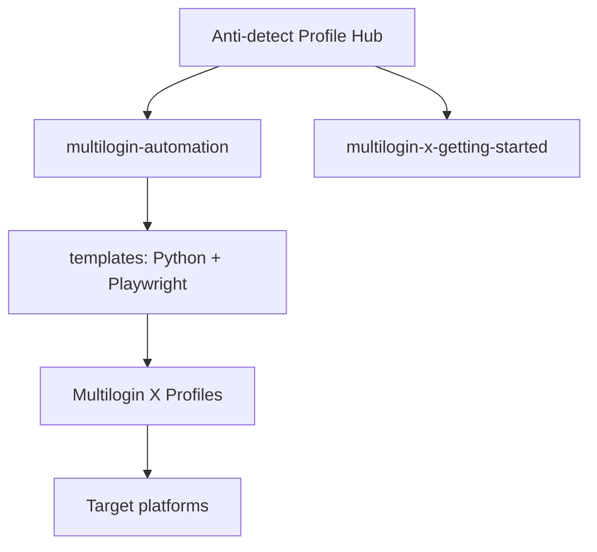

<!--
title: Anti-detect Browser Automation & Multilogin X Solutions
description: Enterprise anti-detect browser fingerprinting, stealth automation SDKs, and Multilogin X integration by ADBLogin.com.
keywords: anti-detect browser, browser fingerprinting, Multilogin X, Playwright, Selenium, browser automation, anti-bot, stealth
homepage: https://adblogin.com
author: ADBLogin.com
-->

# Anti-detect Browser Automation & Stealth Solutions

**Enterprise anti-detect browser fingerprinting, Multilogin X automation, and open-source dev kits** — by [ADBLogin.com](https://adblogin.com) and [@multilogin-automation](https://github.com/multilogin-automation).

<p align="left">
  
  
  <a href="README.vi.md"></a>
  <a href="https://adblogin.com"></a>
  <a href="LICENSE"></a>
  <a href="SECURITY.md"></a>
  <a href="https://github.com/multilogin-automation/multilogin-automation"></a>
</p>

<p align="left">
  
  
</p>

## Table of contents

- [What is this repository?](#what-is-this-repository)
- [Who is this for?](#who-is-this-for)
- [Key capabilities](#key-capabilities)
- [Architecture](#architecture)
- [Quick start](#quick-start)
- [Open-source dev kits](#open-source-dev-kits)
- [Why anti-detect fingerprinting matters](#why-anti-detect-fingerprinting-matters)
- [FAQ](#frequently-asked-questions)
- [Partner offer](#partner-offer)
- [Contact & ecosystem](#contact--ecosystem)
- [Repository settings (SEO)](#repository-settings-seo)
- [Documentation](#documentation)

---

## What is this repository?

Official **GitHub profile README** for [Anti-detect](https://github.com/Anti-detect): discovery hub for **anti-detect browser** engineering, **Multilogin X** workflows, and **stealth automation** (Playwright, Selenium, Python).

Senior automation practice (10+ years): **digital twins**—scripts that match real user behavior on MLX-class infrastructure, including Cloudflare/Akamai-heavy targets.

## Who is this for?

| Audience | Use case |
|----------|----------|
| Automation engineers | Scale UI jobs with isolated fingerprints |
| MMO & growth teams | Multi-account ops without profile linkage |
| Agencies | Custom MLX / anti-detect delivery |
| Developers | Evaluate kits before production spend |

---

## Key capabilities

| Area | Deliverable |
|------|-------------|
| **Browser fingerprinting** | Per-profile UA, Canvas, WebGL, AudioContext, fonts |
| **Human-like behavior** | Mouse curves, typing variance, session timing |
| **Multilogin X** | API + local launcher patterns, token/profile tooling |
| **Open source** | Verified repos + `/templates` in `multilogin-automation` |
| **Custom builds** | End-to-end automation for high-friction sites |

---

## Architecture



Details: [docs/architecture.md](docs/architecture.md) · [docs/comparison-anti-detect-vs-chrome.md](docs/comparison-anti-detect-vs-chrome.md)

---

## Quick start

| Step | Action |
|------|--------|
| 1 | New to MLX → [multilogin-x-getting-started](https://github.com/multilogin-automation/multilogin-x-getting-started) |
| 2 | Tokens & IDs → [multilogin-x-id-token-retrieval-tools](https://github.com/multilogin-automation/multilogin-x-id-token-retrieval-tools) |
| 3 | Code templates → [`multilogin-automation/templates`](https://github.com/multilogin-automation/multilogin-automation/tree/main/templates) |
| 4 | Infrastructure → [ADBLogin.com](https://adblogin.com) · code **`ADBNEW50`** |

Full paths: [docs/getting-started.md](docs/getting-started.md)

---

## Open-source dev kits

Verified repositories (see [docs/open-source-catalog.md](docs/open-source-catalog.md)):

| Priority | Repository | Description |
|----------|------------|-------------|
| ⭐ | [multilogin-automation](https://github.com/multilogin-automation/multilogin-automation) | Master hub + Playwright/Python templates |
| 🚀 | [multilogin-x-getting-started](https://github.com/multilogin-automation/multilogin-x-getting-started) | MLX onboarding |
| 🔑 | [multilogin-x-id-token-retrieval-tools](https://github.com/multilogin-automation/multilogin-x-id-token-retrieval-tools) | Tokens, profile & workspace IDs |
| 🍪 | [multilogin_x_auto_cookie_collector](https://github.com/multilogin-automation/multilogin_x_auto_cookie_collector) | Cookie warming |
| 🛡️ | [undetectable-fingerprint-browser](https://github.com/multilogin-automation/undetectable-fingerprint-browser) | OSS anti-detect / fingerprint spoofing |

**Templates (in-repo):**

- [`mlx_config_template.py`](https://github.com/multilogin-automation/multilogin-automation/blob/main/templates/mlx_config_template.py) — MLX API boilerplate  
- [`playwright_stealth.py`](https://github.com/multilogin-automation/multilogin-automation/blob/main/templates/playwright_stealth.py) — Playwright stealth hooks  

---

## Why anti-detect fingerprinting matters

Sites fuse **TLS**, **IP reputation**, **JS challenges**, and **browser fingerprint** clusters. One shared Canvas hash or WebGL renderer across accounts can flag an entire fleet.

**ADBLogin** ships coherent **anti-detect profiles**: fingerprint, behavior, and network context aligned per session on **Multilogin X**-class stacks.

---

## Frequently asked questions

### What is an anti-detect browser?

Software that isolates fingerprints, storage, and proxies so each profile resembles a separate device—used for QA, automation, and multi-account workflows.

### Where is the Playwright / Python / Selenium code?

In [@multilogin-automation](https://github.com/multilogin-automation), especially [`multilogin-automation/templates`](https://github.com/multilogin-automation/multilogin-automation/tree/main/templates). This profile repo is documentation-only.

### How do I get 50% off Multilogin X?

Use **`ADBNEW50`** at [ADBLogin.com/go/multilogin](https://adblogin.com/go/multilogin). Cloud phone promos may use **`SAVE50`** (see kit READMEs).

### How do I report security issues?

[SECURITY.md](SECURITY.md) — no public issues for sensitive reports.

More: [docs/faq.md](docs/faq.md) · [README.vi.md](README.vi.md)

---

## Partner offer

Code **`ADBNEW50`** — **50% off** first purchase:

**[ADBLogin.com/go/multilogin](https://adblogin.com/go/multilogin)**

---

## Contact & ecosystem

| Channel | Link |
|---------|------|
| Telegram (group) | [@ToolsKiemTrieuDoGroup](https://t.me/ToolsKiemTrieuDoGroup) |
| Telegram | [@ToolsKiemTrieuDo](https://t.me/ToolsKiemTrieuDo) |
| Email | [business@adblogin.com](mailto:business@adblogin.com) |
| Website | [ADBLogin.com](https://adblogin.com) |
| Ecosystem | [ToolKiemTrieuDo.com](https://toolskiemtrieudo.com) |

**Tiếng Việt:** [README.vi.md](README.vi.md) · [docs/faq.md](docs/faq.md)

---

## Repository settings (SEO)

Metadata is defined in [`.github/repo-metadata.json`](.github/repo-metadata.json) and **applied automatically** on every push to `main` by the [Sync repository settings](.github/workflows/sync-repo-settings.yml) workflow (`administration: write`).

Manual override (optional):

```powershell
$env:GITHUB_TOKEN = "ghp_YOUR_TOKEN"
.\scripts\set-github-about.ps1
```

**Also do once on GitHub UI:** [social preview + pinned repos](docs/github-profile-setup.md)

---

## Documentation

| Doc | Purpose |
|-----|---------|
| [docs/README.md](docs/README.md) | Documentation index |
| [docs/getting-started.md](docs/getting-started.md) | Onboarding |
| [docs/open-source-catalog.md](docs/open-source-catalog.md) | All verified repos |
| [docs/architecture.md](docs/architecture.md) | System design |
| [docs/glossary.md](docs/glossary.md) | Terminology |
| [docs/seo-checklist.md](docs/seo-checklist.md) | Maintainer SEO |
| [SUPPORT.md](SUPPORT.md) | Support routing |
| [CHANGELOG.md](CHANGELOG.md) | Change history |
| [CONTRIBUTING.md](CONTRIBUTING.md) | Contribute |
| [SECURITY.md](SECURITY.md) | Security |

---

<p align="center">
  <a href="https://github.com/multilogin-automation/multilogin-automation/stargazers">
    
  </a>
</p>

<p align="center">
  <sub>Anti-detect browser · Multilogin X · Playwright · Selenium · ADBLogin.com</sub>
</p>
