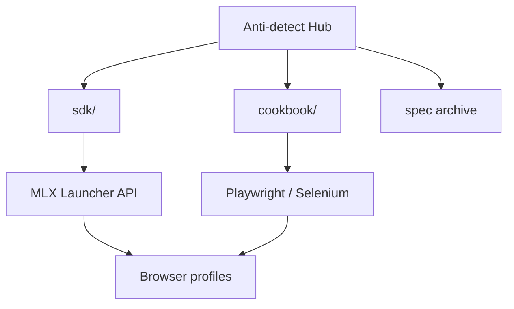

<!--
title: Anti-detect Browser & Multilogin X — Русская документация
description: Хаб Multilogin X №1 — 12 рецептов API, CLI mlx, Cloud Real Phone (MIN50), SDK Playwright/Selenium, сравнение с GoLogin/AdsPower.
keywords: anti-detect браузер, Multilogin X, Cloud Real Phone, MIN50, SAAS50, отпечаток браузера, Playwright, Selenium, MMO
homepage: https://multilogin.com/pricing/?utm_source=saas&utm_medium=partner&a_aid=saas&a_bid=f5fad549
lang: ru
-->

# Anti-detect Browser · Fingerprinting · Multilogin X

**Самодостаточный хаб** для **anti-detect браузеров**, **browser fingerprinting**, автоматизации API **Multilogin X (MLX)** и скрытных workflow **Playwright / Selenium**.

SDK, cookbook API, руководства и архив Postman — **всё в этом репозитории**.

> **Multilogin X — [Тарифы](https://multilogin.com/pricing/?utm_source=saas&utm_medium=partner&a_aid=saas&a_bid=f5fad549)** · **`SAAS50`** (промокод Multilogin) · **`MIN50`** (Multilogin Cloud Real Phone)

<p align="left">
  <a href="https://multilogin.com/pricing/?utm_source=saas&utm_medium=partner&a_aid=saas&a_bid=f5fad549"></a>
</p>

<p align="left">
  
  
  <a href="README.md"></a>
  <a href="README.vi.md"></a>
  <a href="README.zh-CN.md"></a>
  <a href="README.ru.md"></a>
  <a href="README.id.md"></a>
  <a href="README.pt-BR.md"></a>
  <a href="README.ko.md"></a>
  <a href="README.ja.md"></a>
  <a href="README.th.md"></a>
  <a href="README.es.md"></a>
  <a href="LICENSE"></a>
  <a href="SECURITY.md"></a>
</p>

<p align="left">
  
  
  
</p>

## Содержание

- [Почему №1 на GitHub](#почему-1-на-github-для-multilogin)
- [Что это за репозиторий](#что-это-за-репозиторий)
- [Cloud Real Phone (MIN50)](#multilogin-cloud-real-phone)
- [Быстрый старт](#быстрый-старт)
- [SDK и cookbook API](#sdk-и-cookbook-api-multilogin-x)
- [Сравнение](#сравнение-и-выбор)
- [Документация](#документация)
- [FAQ](#часто-задаваемые-вопросы)
- [Тарифы Multilogin](#тарифы-multilogin)
- [Языки](#языки)

---

## Почему №1 на GitHub для Multilogin

| | Этот хаб |
|---|----------|
| **Рецепты** | **12** cookbook + исполняемый Python |
| **CLI** | `mlx start` · `stop` · `profiles export` · `doctor` |
| **SDK** | Python, C#, Java, Node, cURL |
| **Cloud** | `profile/search`, обновление токена, sharding |
| **Mobile** | [Cloud Real Phone](docs/multilogin-cloud-real-phone.md) + **`MIN50`** |
| **Языки** | 10 README |
| **Сравнения** | vs [GoLogin](docs/comparison-multilogin-vs-gologin.md), [AdsPower](docs/comparison-multilogin-vs-adspower.md) |

Подробнее: [docs/why-this-hub.md](docs/why-this-hub.md)

---

## Что это за репозиторий

Официальный **GitHub profile README** [@Anti-detect](https://github.com/Anti-detect): **хаб документации + SDK** (MIT):

- **Anti-detect браузер** / изоляция отпечатков
- **Multilogin X** Local Launcher API (start, stop, quick profile)
- **Исполняемый код** в [`sdk/`](sdk/) — Python, C#, Java, Node, cURL
- **Практические рецепты** в [docs/multilogin-api/cookbook/](docs/multilogin-api/cookbook/)
- **Архив Postman** в [docs/multilogin-api/spec/](docs/multilogin-api/spec/)

| Аудитория | Сценарий |
|-----------|----------|
| Инженеры автоматизации | Playwright / Selenium к профилям MLX |
| MMO и growth | Мультиаккаунт и ротация |
| Разработчики | API, SDK, smoke-тесты |
| Mobile / MMO | [Cloud Real Phone](docs/multilogin-cloud-real-phone.md) + desktop fleet |

---

## Multilogin Cloud Real Phone

**Реальные Android-устройства в облаке** — подлинные мобильные отпечатки для платформ, наказывающих desktop-автоматизацию.

| | |
|---|---|
| **Гайд** | [docs/multilogin-cloud-real-phone.md](docs/multilogin-cloud-real-phone.md) |
| **Mobile MMO** | [docs/mobile-mmo-playbook.md](docs/mobile-mmo-playbook.md) |
| **Промо** | **`MIN50`** — [Multilogin pricing](https://multilogin.com/pricing/?utm_source=saas&utm_medium=partner&a_aid=saas&a_bid=f5fad549) |

Desktop — Launcher API ([cookbook](docs/multilogin-api/cookbook/)); mobile — Cloud Real Phone с теми же правилами workspace.

---

## Быстрый старт

| Шаг | Действие |
|-----|----------|
| 1 | Установите Multilogin X и создайте профиль |
| 2 | UUID folder/profile → [docs/token-and-ids.md](docs/token-and-ids.md) |
| 3 | `cp sdk/config.example.env sdk/.env` и заполните ID |
| 4 | `cd sdk/python && pip install -e .` (CLI `mlx`) |
| 5 | `mlx doctor` → `mlx start` или [`recipes/01`](sdk/python/recipes/01_saved_profile_lifecycle.py) |
| 6 | Mobile → [Cloud Real Phone](docs/multilogin-cloud-real-phone.md) · **`MIN50`** |
| 7 | Desktop → [Multilogin pricing](https://multilogin.com/pricing/?utm_source=saas&utm_medium=partner&a_aid=saas&a_bid=f5fad549) · **`SAAS50`** |

Полный путь: [docs/getting-started.md](docs/getting-started.md)

---

## SDK и cookbook API Multilogin X

| Слой | Ссылка |
|------|--------|
| **SDK** | [`sdk/`](sdk/) — `mlx_client`, start/stop/quick |
| **Cookbook** | [docs/multilogin-api/cookbook/](docs/multilogin-api/cookbook/) — **12** рецептов |
| **Cloud API** | [docs/multilogin-api/cloud-api.md](docs/multilogin-api/cloud-api.md) · `mlx profiles export` |
| **API reference** | [docs/multilogin-api/](docs/multilogin-api/) |
| **Postman archive** | [docs/multilogin-api/spec/](docs/multilogin-api/spec/) |
| **Карта библиотек** | [docs/libraries.md](docs/libraries.md) |

```text
sdk/python/
├── mlx_client.py          # Launcher client
├── mlx_helpers.py         # CDP URL, quick v3, retry
├── automation_patterns.py # login + Playwright/Selenium
└── recipes/               # 12 flows
```

| # | Рецепт | Сценарий |
|---|--------|----------|
| 01–05 | Lifecycle → smoke | Launcher + CI |
| 06 | Retry | Временные сбои |
| 07–08 | Login, Selenium | Production attach |
| 09–11 | Cookies | Warm, export, import |
| 12 | Cloud + workers | `profiles.json` + sharding |

Postman: https://documenter.getpostman.com/view/28533318/2s946h9Cv9

---

**Масштабируете флот?** [Multilogin pricing](https://multilogin.com/pricing/?utm_source=saas&utm_medium=partner&a_aid=saas&a_bid=f5fad549) — **`SAAS50`** или **`MIN50`**.

---

## Архитектура



Детали: [docs/architecture.md](docs/architecture.md)

---

## Сравнение и выбор

| Документ | Поисковый запрос |
|----------|------------------|
| [vs GoLogin](docs/comparison-multilogin-vs-gologin.md) | Альтернатива Multilogin |
| [vs AdsPower](docs/comparison-multilogin-vs-adspower.md) | Альтернатива AdsPower |
| [vs Chrome](docs/comparison-anti-detect-vs-chrome.md) | Зачем anti-detect |
| [Use cases](docs/use-cases.md) | По отраслям |
| [Why this hub](docs/why-this-hub.md) | №1 open MLX |

---

## Руководства

| Тема | Документ |
|------|----------|
| Cloud Real Phone | [docs/multilogin-cloud-real-phone.md](docs/multilogin-cloud-real-phone.md) |
| Playwright + MLX | [docs/playwright-mlx-integration.md](docs/playwright-mlx-integration.md) |
| MMO / мультиаккаунт | [docs/mmo-automation-guide.md](docs/mmo-automation-guide.md) |
| Mobile MMO | [docs/mobile-mmo-playbook.md](docs/mobile-mmo-playbook.md) |
| Troubleshooting | [docs/troubleshooting.md](docs/troubleshooting.md) |
| Fingerprint QA | [docs/fingerprint-checklist.md](docs/fingerprint-checklist.md) |
| Рынок | [docs/browser-landscape.md](docs/browser-landscape.md) |

---

## Часто задаваемые вопросы

### Что такое anti-detect браузер?

ПО, изолирующее отпечатки, хранилище и прокси — каждый профиль как отдельное устройство.

### Где код?

В репозитории: [`sdk/`](sdk/) и [cookbook](docs/multilogin-api/cookbook/).

### Как получить ID профиля?

[docs/token-and-ids.md](docs/token-and-ids.md)

### Скидка на Multilogin X?

**`SAAS50`** или **`MIN50`** на [Multilogin pricing](https://multilogin.com/pricing/?utm_source=saas&utm_medium=partner&a_aid=saas&a_bid=f5fad549).

Ещё: [docs/faq.md](docs/faq.md)

---

## Тарифы Multilogin

| Код | Название | Когда |
|-----|----------|-------|
| **`SAAS50`** | Промокод Multilogin | Новый план MLX |
| **`MIN50`** | Multilogin Cloud Real Phone | Cloud Real Phone / entry |

**Оплата:** [Multilogin pricing](https://multilogin.com/pricing/?utm_source=saas&utm_medium=partner&a_aid=saas&a_bid=f5fad549) · [docs/urls.md](docs/urls.md) · [pricing-cta.md](docs/pricing-cta.md)

---

## Языки

| Язык | README |
|------|--------|
| English | [README.md](README.md) |
| Tiếng Việt | [README.vi.md](README.vi.md) |
| 中文 | [README.zh-CN.md](README.zh-CN.md) |
| Русский | Вы здесь |
| Indonesia | [README.id.md](README.id.md) |
| Português (BR) | [README.pt-BR.md](README.pt-BR.md) |
| 한국어 | [README.ko.md](README.ko.md) |
| 日本語 | [README.ja.md](README.ja.md) |
| ไทย | [README.th.md](README.th.md) |
| Español | [README.es.md](README.es.md) |

[Индекс](docs/locales.md)

---

## Документация

| Документ | Назначение |
|----------|------------|
| [docs/README.md](docs/README.md) | Индекс |
| [docs/getting-started.md](docs/getting-started.md) | Onboarding |
| [docs/multilogin-cloud-real-phone.md](docs/multilogin-cloud-real-phone.md) | Cloud Real Phone + MIN50 |
| [docs/troubleshooting.md](docs/troubleshooting.md) | Launcher/CDP/cloud |
| [docs/repository-map.md](docs/repository-map.md) | Структура repo |
| [docs/token-and-ids.md](docs/token-and-ids.md) | UUID и токены |
| [docs/architecture.md](docs/architecture.md) | Архитектура |
| [docs/multilogin-api/cookbook/](docs/multilogin-api/cookbook/) | API recipes |
| [sdk/README.md](sdk/README.md) | SDK |
| [docs/maintenance.md](docs/maintenance.md) | Поддержка |
| [docs/disclaimer.md](docs/disclaimer.md) | Disclaimer |
| [CONTRIBUTING.md](CONTRIBUTING.md) | Вклад |
| [SECURITY.md](SECURITY.md) | Безопасность |
| [CHANGELOG.md](CHANGELOG.md) | История |

---

<p align="center">
  <strong><a href="https://multilogin.com/pricing/?utm_source=saas&utm_medium=partner&a_aid=saas&a_bid=f5fad549">Multilogin X</a></strong> — <code>SAAS50</code> · <code>MIN50</code> (Cloud Real Phone)
</p>

<p align="center">
  <sub>Anti-detect browser · Browser fingerprinting · Multilogin X · Playwright · Selenium</sub>
</p>
