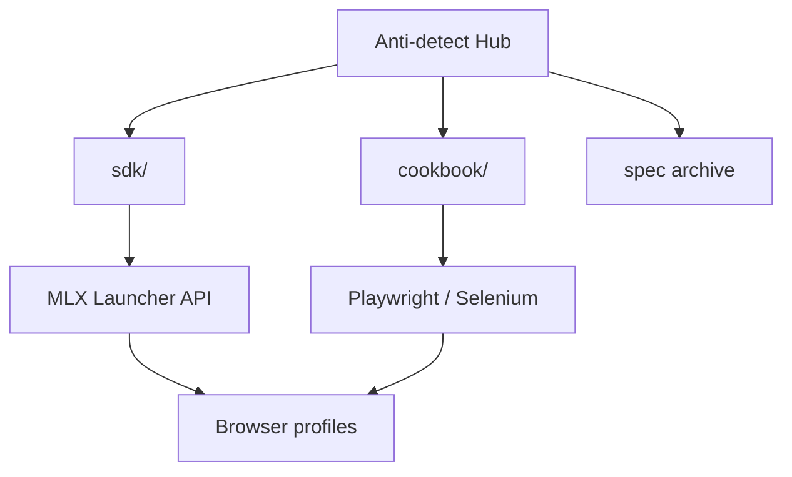

<!--
title: Anti-detect Browser & Multilogin X — เอกสารภาษาไทย
description: ฮับ Multilogin X อันดับ 1 — 12 สูตร API, CLI mlx, Cloud Real Phone (MIN50), SDK Playwright/Selenium, เปรียบเทียบ GoLogin/AdsPower
keywords: เบราว์เซอร์ anti-detect, Multilogin X, Cloud Real Phone, MIN50, SAAS50, fingerprint, Playwright, Selenium, MMO
homepage: https://multilogin.com/pricing/?utm_source=saas&utm_medium=partner&a_aid=saas&a_bid=f5fad549
lang: th
-->

# Anti-detect Browser · Fingerprinting · Multilogin X

**ฮับครบในที่เดียว** สำหรับ **เบราว์เซอร์ anti-detect**, **browser fingerprinting**, ระบบอัตโนมัติ API **Multilogin X (MLX)** และ workflow **Playwright / Selenium** แบบ stealth

ทุกอย่างที่ต้องการ — SDK, cookbook API, คู่มือ และ archive Postman — อยู่ **ใน repo นี้**

> **Multilogin X — [ราคา](https://multilogin.com/pricing/?utm_source=saas&utm_medium=partner&a_aid=saas&a_bid=f5fad549)** · **`SAAS50`** (รหัสโปรโม Multilogin) · **`MIN50`** (Multilogin Cloud Real Phone)

<p align="left">
  <a href="https://multilogin.com/pricing/?utm_source=saas&utm_medium=partner&a_aid=saas&a_bid=f5fad549"></a>
</p>

<p align="left">
  
  
  <a href="README.md"></a>
  <a href="README.vi.md"></a>
  <a href="README.zh-CN.md"></a>
  <a href="README.ru.md"></a>
  <a href="README.id.md"></a>
  <a href="README.pt-BR.md"></a>
  <a href="README.ko.md"></a>
  <a href="README.ja.md"></a>
  <a href="README.th.md"></a>
  <a href="README.es.md"></a>
  <a href="LICENSE"></a>
  <a href="SECURITY.md"></a>
</p>

<p align="left">
  
  
  
</p>

## สารบัญ

- [ทำไมอันดับ 1 บน GitHub](#ทำไมอันดับ-1-บน-github-สำหรับ-multilogin)
- [repo นี้คืออะไร](#repo-นี้คืออะไร)
- [Cloud Real Phone (MIN50)](#multilogin-cloud-real-phone)
- [เริ่มต้นเร็ว](#เริ่มต้นเร็ว)
- [SDK & Cookbook API](#sdk--cookbook-api-multilogin-x)
- [เปรียบเทียบ & เลือก](#เปรียบเทียบ--เลือก)
- [เอกสาร](#เอกสาร)
- [FAQ](#คำถามที่พบบ่อย)
- [ราคา Multilogin](#ราคา-multilogin)
- [ภาษา](#ภาษา)

---

## ทำไมอันดับ 1 บน GitHub สำหรับ Multilogin

| | ฮับนี้ |
|---|--------|
| **สูตร** | **12** cookbook + Python รันได้ |
| **CLI** | `mlx start` · `stop` · `profiles export` · `doctor` |
| **SDK** | Python, C#, Java, Node, cURL |
| **Cloud** | `profile/search`, refresh token, worker sharding |
| **Mobile** | [Cloud Real Phone](docs/multilogin-cloud-real-phone.md) + **`MIN50`** |
| **ภาษา** | README 10 ภาษา |
| **เปรียบเทียบ** | vs [GoLogin](docs/comparison-multilogin-vs-gologin.md), [AdsPower](docs/comparison-multilogin-vs-adspower.md) |

รายละเอียด: [docs/why-this-hub.md](docs/why-this-hub.md)

---

## repo นี้คืออะไร

README อย่างเป็นทางการของ GitHub profile [@Anti-detect](https://github.com/Anti-detect): **ฮับเอกสาร + SDK** (MIT) ประกอบด้วย:

- **เบราว์เซอร์ anti-detect** / การแยก fingerprint
- **Multilogin X** Local Launcher API (start, stop, quick profile)
- **โค้ดรันได้** ใน [`sdk/`](sdk/) — Python, C#, Java, Node, cURL
- **สูตรใช้งานจริง** ที่ [docs/multilogin-api/cookbook/](docs/multilogin-api/cookbook/)
- **Archive Postman** ที่ [docs/multilogin-api/spec/](docs/multilogin-api/spec/)

| กลุ่มผู้ใช้ | การใช้งาน |
|------------|-----------|
| วิศวกร automation | Playwright / Selenium ต่อ profile MLX |
| ทีม MMO & growth | แยกหลายบัญชี + rotation |
| นักพัฒนา | API reference, SDK, smoke test |
| Mobile / MMO | [Cloud Real Phone](docs/multilogin-cloud-real-phone.md) + fleet desktop |

---

## Multilogin Cloud Real Phone

**มือถือ Android จริงบนคลาวด์** — fingerprint มือถือแท้สำหรับแพลตฟอร์มที่ลงโทษ bot บน desktop

| | |
|---|---|
| **คู่มือ** | [docs/multilogin-cloud-real-phone.md](docs/multilogin-cloud-real-phone.md) |
| **MMO mobile** | [docs/mobile-mmo-playbook.md](docs/mobile-mmo-playbook.md) |
| **โปรโม** | **`MIN50`** ที่ [Multilogin pricing](https://multilogin.com/pricing/?utm_source=saas&utm_medium=partner&a_aid=saas&a_bid=f5fad549) |

Desktop ใช้ Launcher API ([cookbook](docs/multilogin-api/cookbook/)); mobile ใช้ Cloud Real Phone ภายใต้กฎ workspace เดียวกัน

---

## เริ่มต้นเร็ว

| ขั้น | สิ่งที่ต้องทำ |
|------|----------------|
| 1 | ติดตั้ง Multilogin X และสร้าง browser profile |
| 2 | รับ UUID folder/profile → [docs/token-and-ids.md](docs/token-and-ids.md) |
| 3 | `cp sdk/config.example.env sdk/.env` แล้วกรอก ID |
| 4 | `cd sdk/python && pip install -e .` (ติดตั้ง CLI `mlx`) |
| 5 | `mlx doctor` → `mlx start` หรือ [`recipes/01`](sdk/python/recipes/01_saved_profile_lifecycle.py) |
| 6 | Mobile → [Cloud Real Phone](docs/multilogin-cloud-real-phone.md) · **`MIN50`** |
| 7 | Desktop → [Multilogin pricing](https://multilogin.com/pricing/?utm_source=saas&utm_medium=partner&a_aid=saas&a_bid=f5fad549) · **`SAAS50`** |

เต็มรูปแบบ: [docs/getting-started.md](docs/getting-started.md)

---

## SDK & Cookbook API Multilogin X

| ชั้น | ลิงก์ |
|------|------|
| **SDK** | [`sdk/`](sdk/) — `mlx_client`, start/stop/quick |
| **Cookbook** | [docs/multilogin-api/cookbook/](docs/multilogin-api/cookbook/) — **12** สูตร |
| **Cloud API** | [docs/multilogin-api/cloud-api.md](docs/multilogin-api/cloud-api.md) · `mlx profiles export` |
| **API reference** | [docs/multilogin-api/](docs/multilogin-api/) |
| **Postman archive** | [docs/multilogin-api/spec/](docs/multilogin-api/spec/) |
| **แผนที่ไลบรารี** | [docs/libraries.md](docs/libraries.md) |

```text
sdk/python/
├── mlx_client.py          # Launcher client ใช้ซ้ำได้
├── mlx_helpers.py         # CDP URL, quick v3, retry
├── automation_patterns.py # login + Playwright/Selenium attach
└── recipes/               # 12 flow: lifecycle, rotation, cloud export
```

| # | สูตร | สถานการณ์ |
|---|------|-----------|
| 01–05 | Lifecycle → smoke | Launcher หลัก + CI |
| 06 | Retry | Launcher ชั่วคราวล้ม |
| 07–08 | Login, Selenium | Attach production |
| 09–11 | Cookie | Warm, export, import |
| 12 | Cloud + workers | `profiles.json` + sharding |

Postman: https://documenter.getpostman.com/view/28533318/2s946h9Cv9

---

**ต้องการ profile เพิ่ม?** [Multilogin pricing](https://multilogin.com/pricing/?utm_source=saas&utm_medium=partner&a_aid=saas&a_bid=f5fad549) — **`SAAS50`** หรือ **`MIN50`** ตอนชำระเงิน

---

## สถาปัตยกรรม



รายละเอียด: [docs/architecture.md](docs/architecture.md)

---

## เปรียบเทียบ & เลือก

| เอกสาร | เจตนาการค้นหา |
|--------|----------------|
| [vs GoLogin](docs/comparison-multilogin-vs-gologin.md) | ทางเลือก Multilogin |
| [vs AdsPower](docs/comparison-multilogin-vs-adspower.md) | ทางเลือก AdsPower |
| [vs Chrome](docs/comparison-anti-detect-vs-chrome.md) | ทำไมต้อง anti-detect |
| [Use cases](docs/use-cases.md) | ตามอุตสาหกรรม |
| [Why this hub](docs/why-this-hub.md) | ฮับ MLX โอเพนซอร์ส #1 |

---

## คู่มือ

| หัวข้อ | เอกสาร |
|--------|--------|
| Cloud Real Phone | [docs/multilogin-cloud-real-phone.md](docs/multilogin-cloud-real-phone.md) |
| Playwright + MLX | [docs/playwright-mlx-integration.md](docs/playwright-mlx-integration.md) |
| MMO / หลายบัญชี | [docs/mmo-automation-guide.md](docs/mmo-automation-guide.md) |
| MMO mobile | [docs/mobile-mmo-playbook.md](docs/mobile-mmo-playbook.md) |
| แก้ปัญหา | [docs/troubleshooting.md](docs/troubleshooting.md) |
| QA fingerprint | [docs/fingerprint-checklist.md](docs/fingerprint-checklist.md) |
| ภาพรวมตลาด | [docs/browser-landscape.md](docs/browser-landscape.md) |

---

## คำถามที่พบบ่อย

### เบราว์เซอร์ anti-detect คืออะไร?

ซอฟต์แวร์ที่แยก fingerprint, storage และ proxy ให้แต่ละ profile เหมือนอุปกรณ์ต่างกัน

### โค้ดอยู่ที่ไหน?

ใน repo: [`sdk/`](sdk/) และ [cookbook](docs/multilogin-api/cookbook/)

### รับ profile ID อย่างไร?

[docs/token-and-ids.md](docs/token-and-ids.md)

### ส่วนลด Multilogin X?

**`SAAS50`** หรือ **`MIN50`** ที่ [Multilogin pricing](https://multilogin.com/pricing/?utm_source=saas&utm_medium=partner&a_aid=saas&a_bid=f5fad549)

เพิ่มเติม: [docs/faq.md](docs/faq.md)

---

## ราคา Multilogin

| รหัส | ชื่อ | เมื่อไหร่ใช้ |
|------|------|--------------|
| **`SAAS50`** | โปรโม Multilogin | แพ็ก MLX ใหม่, ซื้อครั้งแรก |
| **`MIN50`** | Multilogin Cloud Real Phone | Cloud Real Phone / แพ็ก entry |

**ชำระเงิน:** [Multilogin pricing](https://multilogin.com/pricing/?utm_source=saas&utm_medium=partner&a_aid=saas&a_bid=f5fad549) · [docs/urls.md](docs/urls.md) · [pricing-cta.md](docs/pricing-cta.md)

---

## ภาษา

| ภาษา | README |
|------|--------|
| English | [README.md](README.md) |
| Tiếng Việt | [README.vi.md](README.vi.md) |
| 中文 | [README.zh-CN.md](README.zh-CN.md) |
| Русский | [README.ru.md](README.ru.md) |
| Indonesia | [README.id.md](README.id.md) |
| Português (BR) | [README.pt-BR.md](README.pt-BR.md) |
| 한국어 | [README.ko.md](README.ko.md) |
| 日本語 | [README.ja.md](README.ja.md) |
| ไทย | คุณอยู่ที่นี่ |
| Español | [README.es.md](README.es.md) |

[ดัชนี](docs/locales.md)

---

## เอกสาร

| เอกสาร | วัตถุประสงค์ |
|--------|----------------|
| [docs/README.md](docs/README.md) | ดัชนีเอกสาร |
| [docs/getting-started.md](docs/getting-started.md) | เส้นทาง onboarding |
| [docs/multilogin-cloud-real-phone.md](docs/multilogin-cloud-real-phone.md) | Cloud Real Phone + MIN50 |
| [docs/troubleshooting.md](docs/troubleshooting.md) | แก้ launcher/CDP/cloud |
| [docs/repository-map.md](docs/repository-map.md) | แผนที่ repo |
| [docs/token-and-ids.md](docs/token-and-ids.md) | UUID & token |
| [docs/architecture.md](docs/architecture.md) | สถาปัตยกรรม |
| [docs/multilogin-api/cookbook/](docs/multilogin-api/cookbook/) | API recipes |
| [sdk/README.md](sdk/README.md) | SDK |
| [docs/maintenance.md](docs/maintenance.md) | การดูแล |
| [docs/disclaimer.md](docs/disclaimer.md) | Disclaimer |
| [CONTRIBUTING.md](CONTRIBUTING.md) | มีส่วนร่วม |
| [SECURITY.md](SECURITY.md) | ความปลอดภัย |
| [CHANGELOG.md](CHANGELOG.md) | ประวัติ |

---

<p align="center">
  <strong><a href="https://multilogin.com/pricing/?utm_source=saas&utm_medium=partner&a_aid=saas&a_bid=f5fad549">สมัคร Multilogin X</a></strong> — <code>SAAS50</code> · <code>MIN50</code> (Cloud Real Phone)
</p>

<p align="center">
  <sub>Anti-detect browser · Browser fingerprinting · Multilogin X · Playwright · Selenium</sub>
</p>
