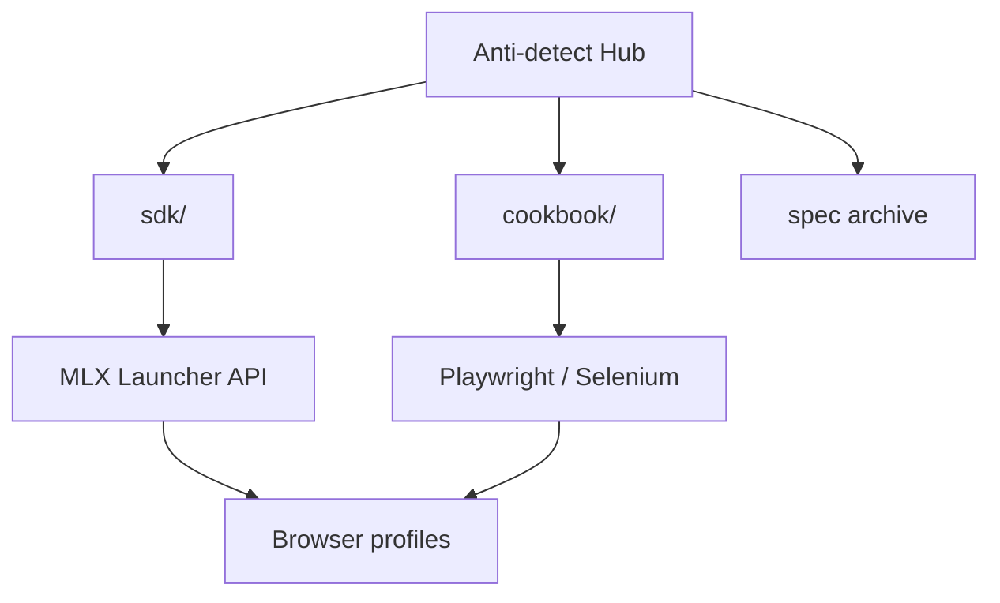

<!--
title: Anti-detect Browser & Multilogin X — Tài liệu tiếng Việt
description: Hub Multilogin X #1 — 12 recipe API, CLI mlx, Cloud Real Phone (MIN50), SDK Playwright/Selenium, so sánh GoLogin/AdsPower.
keywords: trình duyệt anti-detect, Multilogin X, Cloud Real Phone, MIN50, SAAS50, fingerprint, Playwright, Selenium, MMO
homepage: https://multilogin.com/pricing/?utm_source=saas&utm_medium=partner&a_aid=saas&a_bid=f5fad549
lang: vi
-->

# Anti-detect Browser · Fingerprinting · Multilogin X

**Hub tự chứa** cho kỹ thuật **trình duyệt anti-detect**, **browser fingerprinting**, tự động hóa API **Multilogin X (MLX)** và workflow **Playwright / Selenium** ẩn danh.

Mọi thứ bạn cần — SDK, cookbook API, hướng dẫn và archive Postman — nằm **trong repo này**.

> **Multilogin X — [Bảng giá](https://multilogin.com/pricing/?utm_source=saas&utm_medium=partner&a_aid=saas&a_bid=f5fad549)** · **`SAAS50`** (mã promo Multilogin) · **`MIN50`** (Multilogin Cloud Real Phone)

<p align="left">
  <a href="https://multilogin.com/pricing/?utm_source=saas&utm_medium=partner&a_aid=saas&a_bid=f5fad549"></a>
</p>

<p align="left">
  
  
  <a href="README.md"></a>
  <a href="README.vi.md"></a>
  <a href="README.zh-CN.md"></a>
  <a href="README.ru.md"></a>
  <a href="README.id.md"></a>
  <a href="README.pt-BR.md"></a>
  <a href="README.ko.md"></a>
  <a href="README.ja.md"></a>
  <a href="README.th.md"></a>
  <a href="README.es.md"></a>
  <a href="LICENSE"></a>
  <a href="SECURITY.md"></a>
</p>

<p align="left">
  
  
  
</p>

## Mục lục

- [Vì sao #1 trên GitHub](#vì-sao-1-trên-github-cho-multilogin)
- [Repo này là gì?](#repo-này-là-gì)
- [Cloud Real Phone (MIN50)](#multilogin-cloud-real-phone)
- [Bắt đầu nhanh](#bắt-đầu-nhanh)
- [SDK & Cookbook API](#sdk--cookbook-api-multilogin-x)
- [So sánh & chọn](#so-sánh--chọn)
- [Tài liệu](#tài-liệu)
- [FAQ](#câu-hỏi-thường-gặp)
- [Bảng giá Multilogin](#bảng-giá-multilogin)
- [Ngôn ngữ](#ngôn-ngữ)

---

## Vì sao #1 trên GitHub cho Multilogin

| | Hub này |
|---|----------|
| **Recipe** | **12** cookbook + Python chạy được |
| **CLI** | `mlx start` · `stop` · `profiles export` · `doctor` |
| **SDK** | Python, C#, Java, Node, cURL |
| **Cloud** | `profile/search`, refresh token, worker sharding |
| **Mobile** | [Cloud Real Phone](docs/multilogin-cloud-real-phone.md) + **`MIN50`** |
| **Ngôn ngữ** | 10 README đa ngữ |
| **So sánh** | vs [GoLogin](docs/comparison-multilogin-vs-gologin.md), [AdsPower](docs/comparison-multilogin-vs-adspower.md) |

Chi tiết: [docs/why-this-hub.md](docs/why-this-hub.md)

---

## Repo này là gì?

README chính thức GitHub profile [@Anti-detect](https://github.com/Anti-detect): **hub tài liệu + SDK** (MIT) gồm:

- **Trình duyệt anti-detect** / cách tách fingerprint
- **Multilogin X** Local Launcher API (start, stop, quick profile)
- **Code chạy được** trong [`sdk/`](sdk/) — Python, C#, Java, Node, cURL
- **Recipe thực chiến** tại [docs/multilogin-api/cookbook/](docs/multilogin-api/cookbook/)
- **Archive Postman** tại [docs/multilogin-api/spec/](docs/multilogin-api/spec/)

| Đối tượng | Use case |
|-----------|----------|
| Kỹ sư automation | Playwright / Selenium gắn profile MLX |
| Team MMO & growth | Cô lập đa tài khoản + rotation |
| Developer | API reference, SDK copy-paste, smoke test |
| Mobile / MMO | [Cloud Real Phone](docs/multilogin-cloud-real-phone.md) + fleet desktop |

---

## Multilogin Cloud Real Phone

**Điện thoại Android thật trên cloud** — fingerprint mobile chuẩn cho nền tảng phạt automation desktop.

| | |
|---|---|
| **Hướng dẫn** | [docs/multilogin-cloud-real-phone.md](docs/multilogin-cloud-real-phone.md) |
| **MMO mobile** | [docs/mobile-mmo-playbook.md](docs/mobile-mmo-playbook.md) |
| **Mã promo** | **`MIN50`** tại [Multilogin pricing](https://multilogin.com/pricing/?utm_source=saas&utm_medium=partner&a_aid=saas&a_bid=f5fad549) |

Automation desktop dùng Launcher API ([cookbook](docs/multilogin-api/cookbook/)); session mobile dùng Cloud Real Phone cùng quy tắc workspace.

---

## Bắt đầu nhanh

| Bước | Việc cần làm |
|------|----------------|
| 1 | Cài Multilogin X và tạo browser profile |
| 2 | Lấy UUID folder/profile → [docs/token-and-ids.md](docs/token-and-ids.md) |
| 3 | `cp sdk/config.example.env sdk/.env` và điền ID |
| 4 | `cd sdk/python && pip install -e .` (cài CLI `mlx`) |
| 5 | `mlx doctor` → `mlx start` hoặc [`recipes/01`](sdk/python/recipes/01_saved_profile_lifecycle.py) |
| 6 | Lane mobile → [Cloud Real Phone](docs/multilogin-cloud-real-phone.md) · **`MIN50`** |
| 7 | Gói desktop → [Multilogin pricing](https://multilogin.com/pricing/?utm_source=saas&utm_medium=partner&a_aid=saas&a_bid=f5fad549) · **`SAAS50`** |

Đầy đủ: [docs/getting-started.md](docs/getting-started.md)

---

## SDK & Cookbook API Multilogin X

| Lớp | Link |
|-----|------|
| **SDK** | [`sdk/`](sdk/) — `mlx_client`, start/stop/quick |
| **Cookbook** | [docs/multilogin-api/cookbook/](docs/multilogin-api/cookbook/) — **12** recipe thực chiến |
| **Cloud API** | [docs/multilogin-api/cloud-api.md](docs/multilogin-api/cloud-api.md) · `mlx profiles export` |
| **API reference** | [docs/multilogin-api/](docs/multilogin-api/) |
| **Archive Postman** | [docs/multilogin-api/spec/](docs/multilogin-api/spec/) |
| **Bản đồ thư viện** | [docs/libraries.md](docs/libraries.md) |

```text
sdk/python/
├── mlx_client.py          # Launcher client tái sử dụng
├── mlx_helpers.py         # CDP URL, quick v3, retry
├── automation_patterns.py # login + Playwright/Selenium attach
└── recipes/               # 12 flow: lifecycle, rotation, cloud export
```

| # | Recipe | Kịch bản |
|---|--------|----------|
| 01–05 | Lifecycle → smoke | Launcher cốt lõi + CI |
| 06 | Retry lỗi | Launcher tạm lỗi |
| 07–08 | Login, Selenium | Attach production |
| 09–11 | Cookie | Warm, export, import |
| 12 | Cloud + workers | `profiles.json` + sharding |

Postman: [bộ sưu tập Postman](https://documenter.getpostman.com/view/28533318/2s946h9Cv9)

---

**Cần thêm profile?** [Multilogin pricing](https://multilogin.com/pricing/?utm_source=saas&utm_medium=partner&a_aid=saas&a_bid=f5fad549) — **`SAAS50`** hoặc **`MIN50`** khi thanh toán.

---

## Kiến trúc



Chi tiết: [docs/architecture.md](docs/architecture.md)

---

## So sánh & chọn

| Tài liệu | Ý định tìm kiếm |
|----------|-----------------|
| [vs GoLogin](docs/comparison-multilogin-vs-gologin.md) | Thay thế Multilogin |
| [vs AdsPower](docs/comparison-multilogin-vs-adspower.md) | Thay thế AdsPower |
| [vs Chrome](docs/comparison-anti-detect-vs-chrome.md) | Vì sao anti-detect |
| [Use cases](docs/use-cases.md) | Theo ngành |
| [Why this hub](docs/why-this-hub.md) | Hub MLX mã nguồn mở #1 |

---

## Hướng dẫn

| Chủ đề | Tài liệu |
|--------|----------|
| Cloud Real Phone | [docs/multilogin-cloud-real-phone.md](docs/multilogin-cloud-real-phone.md) |
| Playwright + MLX | [docs/playwright-mlx-integration.md](docs/playwright-mlx-integration.md) |
| MMO / đa tài khoản | [docs/mmo-automation-guide.md](docs/mmo-automation-guide.md) |
| MMO mobile | [docs/mobile-mmo-playbook.md](docs/mobile-mmo-playbook.md) |
| Xử lý lỗi | [docs/troubleshooting.md](docs/troubleshooting.md) |
| QA fingerprint | [docs/fingerprint-checklist.md](docs/fingerprint-checklist.md) |
| Thị trường | [docs/browser-landscape.md](docs/browser-landscape.md) |

---

## Câu hỏi thường gặp

### Trình duyệt anti-detect là gì?

Phần mềm tách fingerprint, storage và proxy để mỗi profile giống một thiết bị riêng.

### Code ở đâu?

Trong repo: [`sdk/`](sdk/) và [cookbook](docs/multilogin-api/cookbook/).

### Lấy profile ID thế nào?

[docs/token-and-ids.md](docs/token-and-ids.md)

### Giảm giá Multilogin X?

**`SAAS50`** hoặc **`MIN50`** tại [Multilogin pricing](https://multilogin.com/pricing/?utm_source=saas&utm_medium=partner&a_aid=saas&a_bid=f5fad549).

Thêm: [docs/faq.md](docs/faq.md)

---

## Bảng giá Multilogin

| Mã | Nhãn | Khi nào dùng |
|----|------|--------------|
| **`SAAS50`** | Mã promo Multilogin | Gói MLX mới, lần mua đầu |
| **`MIN50`** | Multilogin Cloud Real Phone | Cloud Real Phone / gói entry |

**Thanh toán:** [Multilogin pricing](https://multilogin.com/pricing/?utm_source=saas&utm_medium=partner&a_aid=saas&a_bid=f5fad549) · [docs/urls.md](docs/urls.md) · [pricing-cta.md](docs/pricing-cta.md)

---

## Ngôn ngữ

| Locale | README |
|--------|--------|
| English | [README.md](README.md) |
| Tiếng Việt | Bạn đang ở đây |
| 中文 | [README.zh-CN.md](README.zh-CN.md) |
| Русский | [README.ru.md](README.ru.md) |
| Indonesia | [README.id.md](README.id.md) |
| Português (BR) | [README.pt-BR.md](README.pt-BR.md) |
| 한국어 | [README.ko.md](README.ko.md) |
| 日本語 | [README.ja.md](README.ja.md) |
| ไทย | [README.th.md](README.th.md) |
| Español | [README.es.md](README.es.md) |

[Index](docs/locales.md)

---

## Tài liệu

| Doc | Mục đích |
|-----|----------|
| [docs/README.md](docs/README.md) | Mục lục tài liệu |
| [docs/getting-started.md](docs/getting-started.md) | Lộ trình onboarding |
| [docs/multilogin-cloud-real-phone.md](docs/multilogin-cloud-real-phone.md) | Cloud Real Phone + MIN50 |
| [docs/troubleshooting.md](docs/troubleshooting.md) | Sửa launcher/CDP/cloud |
| [docs/repository-map.md](docs/repository-map.md) | Bản đồ repo |
| [docs/token-and-ids.md](docs/token-and-ids.md) | UUID & token |
| [docs/architecture.md](docs/architecture.md) | Kiến trúc |
| [docs/multilogin-api/cookbook/](docs/multilogin-api/cookbook/) | API recipes |
| [sdk/README.md](sdk/README.md) | SDK |
| [docs/maintenance.md](docs/maintenance.md) | Bảo trì |
| [docs/disclaimer.md](docs/disclaimer.md) | Disclaimer |
| [CONTRIBUTING.md](CONTRIBUTING.md) | Đóng góp |
| [SECURITY.md](SECURITY.md) | Bảo mật |
| [docs/pricing-cta.md](docs/pricing-cta.md) | CTA affiliate (**SAAS50** / **MIN50**) |

---

<p align="center">
  <strong><a href="https://multilogin.com/pricing/?utm_source=saas&utm_medium=partner&a_aid=saas&a_bid=f5fad549">Đăng ký Multilogin X</a></strong> — <code>SAAS50</code> · <code>MIN50</code> (Cloud Real Phone)
</p>

<p align="center">
  <sub>Anti-detect browser · Browser fingerprinting · Multilogin X · Playwright · Selenium</sub>
</p>
