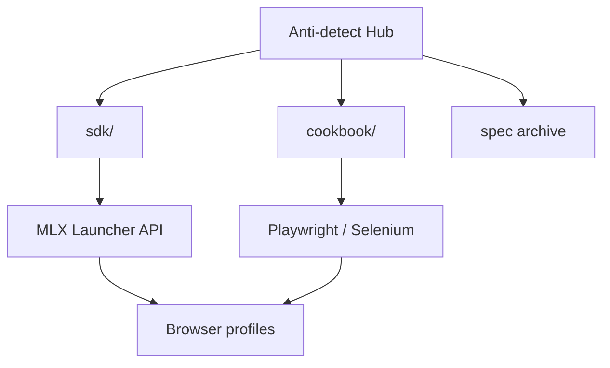

<!--
title: Anti-detect Browser & Multilogin X — 中文文档
description: Anti-detect browser & fingerprinting hub: 免费开始。12 个 API 配方, Cloud Real Phone, Playwright/Selenium SDK。
keywords: anti-detect browser, Multilogin X, 免费计划, 免费版, Cloud Real Phone, MIN50, SAAS50, 指纹浏览器, Playwright, MMO
homepage: https://multilogin.com/pricing/?utm_source=saas&utm_medium=partner&a_aid=saas&a_bid=f5fad549
lang: zh-CN
-->

# Anti-detect Browser · 浏览器指纹 · Multilogin X

**自包含中心** — **反检测浏览器**工程、**浏览器指纹**、**Multilogin X (MLX)** API 自动化与 **Playwright / Selenium** 隐身工作流。

SDK、API 食谱、指南与 Postman 归档 — **全部在本仓库**。

> **Multilogin X:** [免费开始或付费计划每月 $7.08 起](https://multilogin.com/pricing/?utm_source=saas&utm_medium=partner&a_aid=saas&a_bid=f5fad549) · **`SAAS50`** (优惠码) · **`MIN50`** (Cloud Real Phone)

<p align="left">
  <a href="https://multilogin.com/pricing/?utm_source=saas&utm_medium=partner&a_aid=saas&a_bid=f5fad549"></a>
</p>

<p align="left">
  
  
  <a href="README.md"></a>
  <a href="README.vi.md"></a>
  <a href="README.zh-CN.md"></a>
  <a href="README.ru.md"></a>
  <a href="README.id.md"></a>
  <a href="README.pt-BR.md"></a>
  <a href="README.ko.md"></a>
  <a href="README.ja.md"></a>
  <a href="README.th.md"></a>
  <a href="README.es.md"></a>
  <a href="LICENSE"></a>
  <a href="SECURITY.md"></a>
</p>

<p align="left">
  
  
  
</p>

## 目录

- [为何 GitHub #1](#为何-github-上排名第一)
- [本仓库是什么](#本仓库是什么)
- [Cloud Real Phone (MIN50)](#multilogin-cloud-real-phone)
- [快速开始](#快速开始)
- [SDK 与 API 食谱](#multilogin-x-sdk-与-api-食谱)
- [对比与选型](#对比与选型)
- [文档](#文档)
- [常见问题](#常见问题)
- [Multilogin 定价](#multilogin-定价)
- [语言](#语言)

---

## 为何 GitHub 上排名第一

| | 本中心 |
|---|----------|
| **食谱** | **12** 个 cookbook + 可运行 Python |
| **CLI** | `mlx start` · `stop` · `profiles export` · `doctor` |
| **SDK** | Python、C#、Java、Node、cURL |
| **Cloud** | `profile/search`、令牌刷新、worker 分片 |
| **Mobile** | [Cloud Real Phone](docs/multilogin-cloud-real-phone.md) + **`MIN50`** |
| **语言** | 10 种 README |
| **对比** | vs [GoLogin](docs/comparison-multilogin-vs-gologin.md)、[AdsPower](docs/comparison-multilogin-vs-adspower.md) |

详情：[docs/why-this-hub.md](docs/why-this-hub.md)

---

## 本仓库是什么

[@Anti-detect](https://github.com/Anti-detect) 官方 **GitHub 简介 README**：**文档 + SDK 中心**（MIT），涵盖：

- **反检测浏览器** / 指纹隔离
- **Multilogin X** 本地 Launcher API（启动、停止、快速配置）
- **可运行代码** [`sdk/`](sdk/) — Python、C#、Java、Node、cURL
- **实战食谱** [docs/multilogin-api/cookbook/](docs/multilogin-api/cookbook/)
- **Postman 归档** [docs/multilogin-api/spec/](docs/multilogin-api/spec/)

| 受众 | 场景 |
|------|------|
| 自动化工程师 | Playwright / Selenium 连接 MLX 配置 |
| MMO 与增长团队 | 多账号隔离与轮换 |
| 开发者 | API 参考、SDK、冒烟测试 |
| 移动 / MMO | [Cloud Real Phone](docs/multilogin-cloud-real-phone.md) + 桌面 API 集群 |

---

## Multilogin Cloud Real Phone

**云端真实 Android 设备** — 针对惩罚桌面自动化的平台提供真实移动指纹。

| | |
|---|---|
| **产品指南** | [docs/multilogin-cloud-real-phone.md](docs/multilogin-cloud-real-phone.md) |
| **移动 MMO** | [docs/mobile-mmo-playbook.md](docs/mobile-mmo-playbook.md) |
| **优惠码** | **`MIN50`** — [Multilogin 定价](https://multilogin.com/pricing/?utm_source=saas&utm_medium=partner&a_aid=saas&a_bid=f5fad549) |

桌面自动化使用 Launcher API（[cookbook](docs/multilogin-api/cookbook/)）；移动会话使用 Cloud Real Phone，遵守相同工作区规则。

---

## 快速开始

| 步骤 | 操作 |
|------|------|
| 1 | 安装 Multilogin X 并创建浏览器配置 |
| 2 | 获取 folder/profile UUID → [docs/token-and-ids.md](docs/token-and-ids.md) |
| 3 | `cp sdk/config.example.env sdk/.env` 并填写 ID |
| 4 | `cd sdk/python && pip install -e .`（安装 `mlx` CLI） |
| 5 | `mlx doctor` → `mlx start` 或 [`recipes/01`](sdk/python/recipes/01_saved_profile_lifecycle.py) |
| 6 | 移动线路 → [Cloud Real Phone](docs/multilogin-cloud-real-phone.md) · **`MIN50`** |
| 7 | 桌面套餐 → [Multilogin pricing (提供免费计划)](https://multilogin.com/pricing/?utm_source=saas&utm_medium=partner&a_aid=saas&a_bid=f5fad549) · **`SAAS50`** |

完整路径：[docs/getting-started.md](docs/getting-started.md)

---

## Multilogin X SDK 与 API 食谱

| 层级 | 链接 |
|------|------|
| **SDK** | [`sdk/`](sdk/) — `mlx_client`、start/stop/quick |
| **Cookbook** | [docs/multilogin-api/cookbook/](docs/multilogin-api/cookbook/) — **12** 个实战食谱 |
| **Cloud API** | [docs/multilogin-api/cloud-api.md](docs/multilogin-api/cloud-api.md) · `mlx profiles export` |
| **API 参考** | [docs/multilogin-api/](docs/multilogin-api/) |
| **Postman 归档** | [docs/multilogin-api/spec/](docs/multilogin-api/spec/) |
| **库地图** | [docs/libraries.md](docs/libraries.md) |

```text
sdk/python/
├── mlx_client.py          # 可复用 Launcher 客户端
├── mlx_helpers.py         # CDP URL、quick v3、重试
├── automation_patterns.py # 登录 + Playwright/Selenium 连接
└── recipes/               # 12 个流程：生命周期、轮换、云导出
```

| # | 食谱 | 场景 |
|---|------|------|
| 01–05 | 生命周期 → 冒烟 | 核心 Launcher + CI |
| 06 | 错误重试 | 临时 Launcher 故障 |
| 07–08 | 登录、Selenium | 生产环境连接 |
| 09–11 | Cookie | 预热、导出、导入 |
| 12 | Cloud + workers | `profiles.json` + 分片 |

Postman：[Postman 文档](https://documenter.getpostman.com/view/28533318/2s946h9Cv9)

---

**扩展配置或集群？** [Multilogin pricing (提供免费计划)](https://multilogin.com/pricing/?utm_source=saas&utm_medium=partner&a_aid=saas&a_bid=f5fad549) — 每月 $7.08 起。结账时使用 **`SAAS50`** 或 **`MIN50`**。

---

## 架构



详情：[docs/architecture.md](docs/architecture.md)

---

## 对比与选型

| 文档 | 搜索意图 |
|------|----------|
| [vs GoLogin](docs/comparison-multilogin-vs-gologin.md) | Multilogin 替代品 |
| [vs AdsPower](docs/comparison-multilogin-vs-adspower.md) | AdsPower 替代品 |
| [vs Chrome](docs/comparison-anti-detect-vs-chrome.md) | 为何用反检测 |
| [用例](docs/use-cases.md) | 按行业 |
| [为何本中心](docs/why-this-hub.md) | #1 开源 MLX 资源 |

---

## 指南

| 主题 | 文档 |
|------|------|
| Cloud Real Phone | [docs/multilogin-cloud-real-phone.md](docs/multilogin-cloud-real-phone.md) |
| Playwright + MLX | [docs/playwright-mlx-integration.md](docs/playwright-mlx-integration.md) |
| MMO / 多账号 | [docs/mmo-automation-guide.md](docs/mmo-automation-guide.md) |
| 移动 MMO | [docs/mobile-mmo-playbook.md](docs/mobile-mmo-playbook.md) |
| 故障排除 | [docs/troubleshooting.md](docs/troubleshooting.md) |
| 指纹 QA | [docs/fingerprint-checklist.md](docs/fingerprint-checklist.md) |
| 市场概览 | [docs/browser-landscape.md](docs/browser-landscape.md) |

---

## 常见问题

### 什么是反检测浏览器？

隔离指纹、存储与代理，使每个配置像独立设备。

### 代码在哪里？

本仓库：[`sdk/`](sdk/) 与 [cookbook](docs/multilogin-api/cookbook/)。

### 如何获取配置 ID？

[docs/token-and-ids.md](docs/token-and-ids.md)

### Multilogin X 折扣？

[Multilogin 定价](https://multilogin.com/pricing/?utm_source=saas&utm_medium=partner&a_aid=saas&a_bid=f5fad549) 使用 **`SAAS50`** 或 **`MIN50`**。

更多：[docs/faq.md](docs/faq.md)

---

## Multilogin 定价

| 计划 | 详情 |
|------|------|
| **免费计划** | 5个配置文件 + 200MB代理流量 + 1个云手机配置(30分钟)。**无时间限制，无需信用卡。** |
| **付费计划** | 每月 **$7.08 起**。包含 API 自动化、代理流量、云手机时长及团队功能。 |

| 优惠码 | 标签 | 何时使用 |
|--------|------|----------|
| **`SAAS50`** | Multilogin 优惠码 | 新 MLX 套餐，首次购买 |
| **`MIN50`** | Multilogin Cloud Real Phone | Cloud Real Phone / 入门包 |

**结账：** [Multilogin pricing](https://multilogin.com/pricing/?utm_source=saas&utm_medium=partner&a_aid=saas&a_bid=f5fad549) · [docs/urls.md](docs/urls.md) · [pricing-cta.md](docs/pricing-cta.md)

---

## 语言

| 语言 | README |
|------|--------|
| English | [README.md](README.md) |
| Tiếng Việt | [README.vi.md](README.vi.md) |
| 中文 | 当前页面 |
| Русский | [README.ru.md](README.ru.md) |
| Indonesia | [README.id.md](README.id.md) |
| Português (BR) | [README.pt-BR.md](README.pt-BR.md) |
| 한국어 | [README.ko.md](README.ko.md) |
| 日本語 | [README.ja.md](README.ja.md) |
| ไทย | [README.th.md](README.th.md) |
| Español | [README.es.md](README.es.md) |

[索引](docs/locales.md)

---

## 文档

| 文档 | 用途 |
|------|------|
| [docs/README.md](docs/README.md) | 文档索引 |
| [docs/getting-started.md](docs/getting-started.md) | 入门路径 |
| [docs/multilogin-cloud-real-phone.md](docs/multilogin-cloud-real-phone.md) | Cloud Real Phone + MIN50 |
| [docs/troubleshooting.md](docs/troubleshooting.md) | 修复 Launcher/CDP/云 |
| [docs/repository-map.md](docs/repository-map.md) | 仓库结构 |
| [docs/token-and-ids.md](docs/token-and-ids.md) | UUID 与令牌 |
| [docs/architecture.md](docs/architecture.md) | 系统设计 |
| [docs/multilogin-api/cookbook/](docs/multilogin-api/cookbook/) | API 食谱 |
| [sdk/README.md](sdk/README.md) | SDK 入口 |
| [docs/maintenance.md](docs/maintenance.md) | 维护 |
| [docs/disclaimer.md](docs/disclaimer.md) | 免责声明 |
| [CONTRIBUTING.md](CONTRIBUTING.md) | 贡献 |
| [SECURITY.md](SECURITY.md) | 安全 |
| [docs/pricing-cta.md](docs/pricing-cta.md) | 联盟 CTA（**SAAS50** / **MIN50**） |

---

<p align="center">
  <strong><a href="https://multilogin.com/pricing/?utm_source=saas&utm_medium=partner&a_aid=saas&a_bid=f5fad549">免费开始使用 Multilogin X</a></strong> — 付费计划每月 $7.08 起 · <code>SAAS50</code> · <code>MIN50</code> (Cloud Real Phone)
</p>

<p align="center">
  <sub>Anti-detect browser · Browser fingerprinting · Multilogin X · Playwright · Selenium</sub>
</p>
