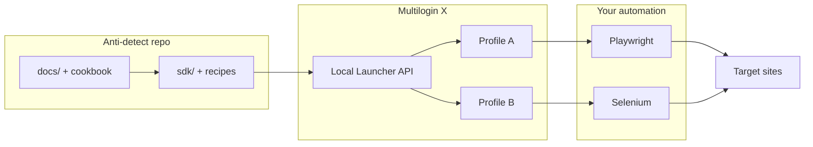

# Architecture overview

How **anti-detect browser automation** fits together using **this repository** and **Multilogin X**.

## High-level flow

## Fingerprint coherence

| Layer | Examples | Risk if mismatched |
|-------|----------|-------------------|
| Network | IP, DNS, timezone, WebRTC | Geo vs locale conflicts |
| Browser | User-Agent, language | Automation tells |
| Graphics | Canvas, WebGL, fonts | Shared hashes across fleet |
| Behavior | Mouse, typing timing | Bot scoring |

## Components in this repo

| Component | Role |
|-----------|------|
| [`sdk/python/mlx_client.py`](../sdk/python/mlx_client.py) | HTTP client for Launcher API |
| [`sdk/python/recipes/`](../sdk/python/recipes/) | End-to-end automation scenarios |
| [`docs/multilogin-api/spec/`](../docs/multilogin-api/spec/) | Archived Postman code samples |
| [`docs/multilogin-api/cookbook/`](../docs/multilogin-api/cookbook/) | Guides + when-to-use |

## Related

- [Getting started](getting-started.md)
- [repository-map.md](repository-map.md)
- [playwright-mlx-integration.md](playwright-mlx-integration.md)

---

**Multilogin X:** [Pricing](https://multilogin.com/pricing/?utm_source=saas&utm_medium=partner&a_aid=saas&a_bid=f5fad549) — **`SAAS50`** (Multilogin promo code) · **`MIN50`** (Multilogin Cloud Real Phone)

