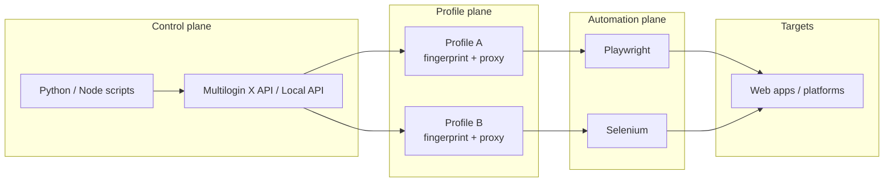

# Architecture overview

How **anti-detect browser automation** pieces fit together in the ADBLogin / Multilogin X ecosystem.

## High-level flow

## Fingerprint coherence

Each profile must keep these signals **internally consistent**:

| Layer | Examples | Risk if mismatched |
|-------|----------|-------------------|
| Network | IP, DNS, timezone, WebRTC leak | Geo vs locale conflicts |
| Browser | User-Agent, Client Hints, language | Obvious automation tells |
| Graphics | Canvas, WebGL, fonts | Duplicate hashes across fleet |
| Behavior | Mouse, scroll, typing timing | Bot scoring |

**Anti-detect** stacks assign or generate per-profile values so automation does not share one detectable identity.

## Repository roles

| Layer | GitHub examples |
|-------|-----------------|
| Onboarding | [multilogin-x-getting-started](https://github.com/multilogin-automation/multilogin-x-getting-started) |
| Templates & MLX core | [multilogin-automation](https://github.com/multilogin-automation/multilogin-automation) |
| Auth / IDs | [multilogin-x-id-token-retrieval-tools](https://github.com/multilogin-automation/multilogin-x-id-token-retrieval-tools) |
| Cookie warming | [multilogin_x_auto_cookie_collector](https://github.com/multilogin-automation/multilogin_x_auto_cookie_collector) |
| OSS fingerprint stack | [undetectable-fingerprint-browser](https://github.com/multilogin-automation/undetectable-fingerprint-browser) |

## This profile repository

`Anti-detect/Anti-detect` is a **discovery and documentation hub** — not the runtime. Executable code lives in [@multilogin-automation](https://github.com/multilogin-automation) repos above.

## Related

- [Getting started](getting-started.md)
- [Glossary](glossary.md)
- [Comparison](comparison-anti-detect-vs-chrome.md)
