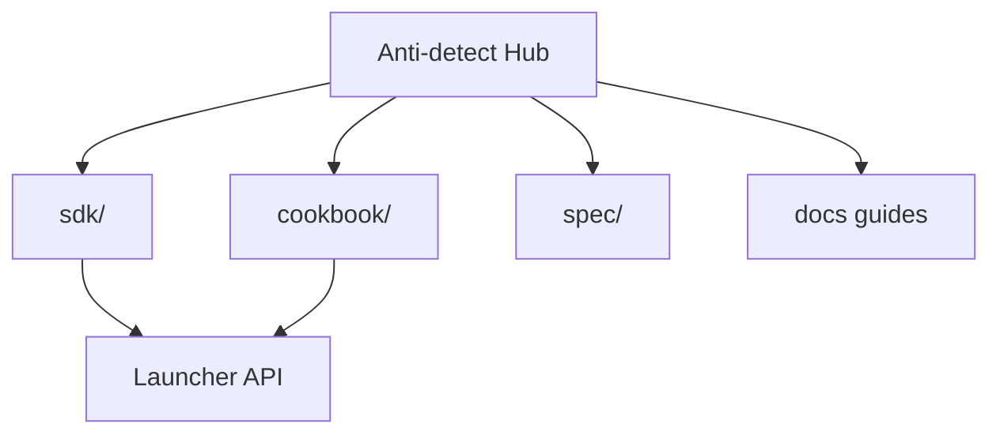

# Library map — this repository

All MLX API and automation resources live **here** — SDK, cookbook, spec archive, and guides.

## SDK & API

| Resource | Link |
|----------|------|
| SDK hub | [sdk/README.md](../sdk/README.md) |
| Python client | [sdk/python/mlx_client.py](../sdk/python/mlx_client.py) |
| mlx CLI | [sdk/python/mlx_cli.py](../sdk/python/mlx_cli.py) |
| Cloud client | [sdk/python/mlx_cloud_client.py](../sdk/python/mlx_cloud_client.py) |
| Python recipes | [sdk/python/recipes/](../sdk/python/recipes/) (12) |
| API cookbook | [multilogin-api/cookbook/](multilogin-api/cookbook/README.md) |
| API reference | [multilogin-api/](multilogin-api/README.md) |
| Postman archive | [multilogin-api/spec/](multilogin-api/spec/README.md) |
| Quick reference | [multilogin-api/quick-reference.md](multilogin-api/quick-reference.md) |

## Guides

| Doc | Topic |
|-----|--------|
| [getting-started.md](getting-started.md) | Onboarding paths |
| [token-and-ids.md](token-and-ids.md) | UUIDs & tokens |
| [playwright-mlx-integration.md](playwright-mlx-integration.md) | Playwright + CDP |
| [multilogin-cloud-real-phone.md](multilogin-cloud-real-phone.md) | Cloud Real Phone + MIN50 |
| [mmo-automation-guide.md](mmo-automation-guide.md) | Multi-account patterns |
| [comparison-multilogin-vs-gologin.md](comparison-multilogin-vs-gologin.md) | vs GoLogin |
| [troubleshooting.md](troubleshooting.md) | Launcher/CDP/cloud fixes |
| [fingerprint-checklist.md](fingerprint-checklist.md) | Fleet QA |
| [browser-landscape.md](browser-landscape.md) | Market keywords |
| [maintenance.md](maintenance.md) | CI & archive workflow |

## Search keywords

`multilogin x api`, `mlx launcher api`, `playwright multilogin`, `selenium multilogin`, `anti-detect browser github`, `browser profile automation`

## Official references

- [Postman — Multilogin X API](https://documenter.getpostman.com/view/28533318/2s946h9Cv9)
- [Multilogin help](https://help.multilogin.com/en_US/multilogin-x)

## Pricing

**SAAS50** / **MIN50** — [urls.md](urls.md)

---

**Multilogin X:** [Pricing](https://multilogin.com/pricing/?utm_source=saas&utm_medium=partner&a_aid=saas&a_bid=f5fad549) — **`SAAS50`** (Multilogin promo code) · **`MIN50`** (Multilogin Cloud Real Phone)

