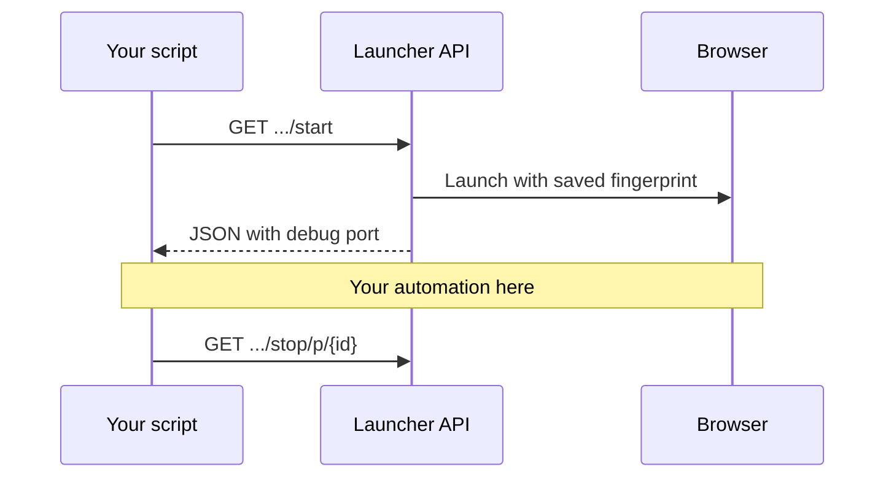

# Recipe 01 — Saved profile lifecycle

## When to use

- Account already has cookies / login state in MLX.
- You run the same bot daily on **one identity**.
- You must **always stop** the profile to free RAM and avoid “profile already running” errors.

## Flow



## Key API calls

| Step | Method | Path |
|------|--------|------|
| Start | GET | `/api/v2/profile/f/{folder_id}/p/{profile_id}/start` |
| Stop | GET | `/api/v1/profile/stop/p/{profile_id}` |

Query params: `automation_type=puppeteer` (or `selenium`), `headless_mode=true|false`.

## Runnable code

**Python:** [`sdk/python/recipes/01_saved_profile_lifecycle.py`](../../../sdk/python/recipes/01_saved_profile_lifecycle.py)

Uses `MlxLauncherClient.profile_session()` so **stop runs even if your script crashes**.

```python
with client.profile_session(folder_id, profile_id) as session:
    cdp_url = extract_cdp_url(session)
    # attach automation
```

## Common mistakes

| Mistake | Fix |
|---------|-----|
| Forgetting to stop | Use `profile_session` context manager |
| Wrong `folder_id` | Folder UUID ≠ profile UUID — check MLX UI |
| `automation_type` mismatch | Use `puppeteer` for Playwright CDP, `selenium` for WebDriver |

## Next

→ [Recipe 02 — Playwright attach](02-playwright-attach.md)
