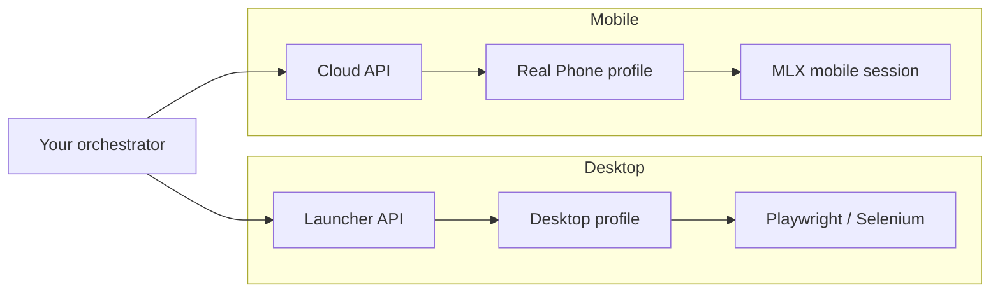

# Multilogin Cloud Real Phone

Guide to **Multilogin Cloud Real Phone** — real Android devices in the cloud with genuine mobile fingerprints. Pair with desktop MLX automation in this repo for a full **desktop + mobile** fleet.

> **Get Cloud Real Phone:** [Multilogin pricing](https://multilogin.com/pricing/?utm_source=saas&utm_medium=partner&a_aid=saas&a_bid=f5fad549) — enter **`MIN50`** at checkout (Multilogin Cloud Real Phone promo).

---

## What is Cloud Real Phone?

| Concept | Detail |
|---------|--------|
| **Real device** | Physical Android phones hosted by Multilogin — not emulators or spoofed desktop UAs |
| **Mobile fingerprint** | Carrier, sensors, GPU, screen, locale — consistent with a real handset |
| **Cloud session** | Remote mobile browser / app context without buying hardware per account |
| **Isolation** | One profile ≈ one mobile identity (same discipline as desktop MLX profiles) |

Platforms that weight **mobile signals** heavily (short-video, social, marketplace mobile web, in-app WebViews) often behave differently on desktop anti-detect browsers. Cloud Real Phone closes that gap.

---

## Desktop MLX vs Cloud Real Phone

| Dimension | Desktop MLX (Mimic / Stealthfox) | Cloud Real Phone |
|-----------|----------------------------------|------------------|
| **Engine** | Chromium-based desktop profiles | Real Android device |
| **Automation in this repo** | Full — Launcher API, 12 recipes, `mlx` CLI | Profile/cloud management via [cloud-api.md](multilogin-api/cloud-api.md); mobile **session** via MLX app & official cloud docs |
| **Best for** | Web dashboards, ads managers, SaaS, scraping logged-in web | Mobile-first flows, app-adjacent web, TikTok/IG mobile web, geo-mobile checks |
| **Local agent** | Multilogin X launcher on your PC | Cloud-hosted device pool |
| **Promo code** | **`SAAS50`** (general MLX plans) | **`MIN50`** (Cloud Real Phone / entry cloud bundles) |

---

## When to choose Cloud Real Phone

| Scenario | Why Real Phone |
|----------|----------------|
| Mobile-only or mobile-weighted platform | Desktop fingerprint stack may not match expected device class |
| Account warmed on phone | Continue same identity class in cloud without physical farm |
| Geo + carrier consistency | Real SIM/carrier metadata on supported plans |
| Compliance with “real device” checks | Hardware-backed signals vs emulated mobile UA |
| MMO mobile lane | Separate mobile account pool parallel to desktop bots |

**Stay on desktop MLX** when the target is a full desktop web app, you already pass checks with Mimic/Stealthfox + good proxy, and Launcher API automation ([cookbook](multilogin-api/cookbook/)) is enough.

---

## MIN50 — Multilogin Cloud Real Phone promo

| Code | Use at checkout |
|------|-----------------|
| **`MIN50`** | Multilogin Cloud Real Phone — minimum-tier / Real Phone bundle offers |
| **`SAAS50`** | General Multilogin X desktop plans (often combined in a mixed fleet) |

**Checkout:** [multilogin.com/pricing](https://multilogin.com/pricing/?utm_source=saas&utm_medium=partner&a_aid=saas&a_bid=f5fad549)

---

## Recommended workflow (desktop + mobile fleet)

### 1. Provision

1. Purchase Cloud Real Phone plan with **`MIN50`**.
2. Create mobile profiles in MLX UI (separate folders per campaign/client).
3. Purchase desktop MLX with **`SAAS50`** if you run web automation in parallel.

### 2. Identity rules (same as MMO desktop)

- **One account → one profile** (mobile or desktop — never share).
- **Proxy country** matches profile locale and timezone.
- **Do not** mix cookies between desktop and mobile profiles for the same account unless you understand platform risk.

### 3. Automate what this repo covers today

| Task | Tool in this repo |
|------|-------------------|
| List/export profile UUIDs (cloud) | `mlx profiles export` · [Recipe 12](multilogin-api/cookbook/12-cloud-export-and-workers.md) |
| Desktop start/stop/rotate | [Recipes 01–04](multilogin-api/cookbook/README.md), `mlx start` |
| Token refresh | `mlx refresh` · [cloud-api.md](multilogin-api/cloud-api.md) |
| Cookie warm (desktop) | [Recipe 09](multilogin-api/cookbook/09-cookie-warm-export.md) |

Mobile **session control** (launch Real Phone, in-session automation) — follow [Multilogin help center](https://help.multilogin.com/en_US/multilogin-x) and live Postman for cloud/mobile endpoints as Multilogin ships them.

### 4. Scale

- Desktop fleet: [Recipe 12 workers](multilogin-api/cookbook/12-cloud-export-and-workers.md) + [MMO guide](mmo-automation-guide.md).
- Mobile fleet: add devices/plans via pricing; keep human-like session pacing.

---

## Cloud Real Phone + MMO

| Layer | Desktop | Mobile (Real Phone) |
|-------|---------|---------------------|
| Account pool | `profiles.json` + Recipe 04 | Separate mobile profile list |
| Warm-up | Recipes 07, 09 | Manual warm in mobile session first |
| Monitoring | Recipe 10 scrape (web) | Platform-native mobile checks |
| Promo | SAAS50 | **MIN50** |

Deep dive: [mmo-automation-guide.md](mmo-automation-guide.md) · [mobile-mmo-playbook.md](mobile-mmo-playbook.md)

---

## FAQ

### Is Cloud Real Phone an emulator?

No — Multilogin positions it as **real phones** in the cloud, unlike desktop “mobile UA” spoofing.

### Can I use Playwright from this repo on Real Phone?

Desktop Launcher CDP recipes (02, 07, 08) target the **local MLX agent**. Real Phone uses the cloud mobile stack — use MLX’s mobile/cloud workflow; use this repo for **profile IDs**, cloud token, and fleet JSON export.

### MIN50 vs SAAS50?

- **`MIN50`** — Cloud Real Phone / entry cloud phone bundles.
- **`SAAS50`** — Broader Multilogin X desktop / plan promos.

### Where are official API docs?

[Multilogin X API — Postman](https://documenter.getpostman.com/view/28533318/2s946h9Cv9) · [help.multilogin.com](https://help.multilogin.com/en_US/multilogin-x)

---

## Related

- [cloud-api.md](multilogin-api/cloud-api.md) — bearer token, `profile/search`
- [token-and-ids.md](token-and-ids.md) — UUIDs
- [comparison-multilogin-vs-gologin.md](comparison-multilogin-vs-gologin.md)
- [troubleshooting.md](troubleshooting.md)

---

**Multilogin X:** [Pricing](https://multilogin.com/pricing/?utm_source=saas&utm_medium=partner&a_aid=saas&a_bid=f5fad549) — **`SAAS50`** · **`MIN50`** (Cloud Real Phone)
