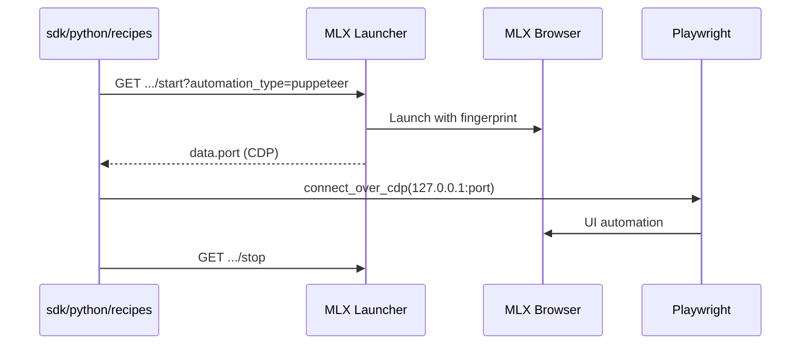

# Playwright + Multilogin X integration

Attach **Playwright** to a browser launched by MLX Local Launcher API — code and guides are **in this repo**.

## Prerequisites

- Multilogin X installed and licensed
- Python 3.10+
- Profile UUIDs in `sdk/.env` — [token-and-ids.md](token-and-ids.md)

## Flow



## Runnable recipe

**[Recipe 02](multilogin-api/cookbook/02-playwright-attach.md)** — [`sdk/python/recipes/02_playwright_attach.py`](../sdk/python/recipes/02_playwright_attach.py)

```bash
cd sdk/python
pip install -r requirements.txt playwright
playwright install chromium
python recipes/02_playwright_attach.py
```

Shared helpers: [`automation_patterns.py`](../sdk/python/automation_patterns.py)

## Key rules

1. Start profile with `automation_type=puppeteer` (not vanilla `chromium.launch()`).
2. Use `connect_over_cdp()` with the port from the start response.
3. Always stop the profile — use `MlxLauncherClient.profile_session()`.

## Selenium alternative

[Recipe 08](multilogin-api/cookbook/08-selenium-attach.md) — `automation_type=selenium` + `debuggerAddress`.

## Troubleshooting

| Issue | Fix |
|-------|-----|
| Cannot connect | Wrong port; profile still starting — retry |
| Instant block | [fingerprint-checklist.md](fingerprint-checklist.md) |
| 401 on cloud API | Refresh bearer token — [authentication.md](multilogin-api/authentication.md) |

## Related

- [getting-started.md](getting-started.md) Path C
- [architecture.md](architecture.md)
