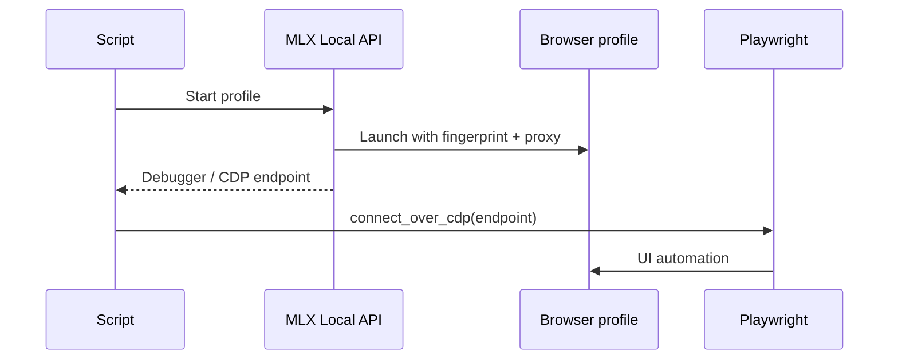

# Playwright + Multilogin X integration

Step-by-step outline for **stealth Playwright** automation attached to an MLX-launched browser. Full code lives in [@multilogin-automation](https://github.com/multilogin-automation) templates.

## Prerequisites

- Multilogin X installed and licensed
- Python 3.10+ (or stack required by target kit README)
- API token / profile ID from [id-token tools](https://github.com/multilogin-automation/multilogin-x-id-token-retrieval-tools)

## Flow

## Runnable recipe in this repo

**[Recipe 02 — Playwright attach](multilogin-api/cookbook/02-playwright-attach.md)** with code at [`sdk/python/recipes/02_playwright_attach.py`](../sdk/python/recipes/02_playwright_attach.py).

## Implementation pointers

1. Copy [`mlx_config_template.py`](https://github.com/multilogin-automation/multilogin-automation/blob/main/templates/mlx_config_template.py) for API auth and profile start.
2. Apply [`playwright_stealth.py`](https://github.com/multilogin-automation/multilogin-automation/blob/main/templates/playwright_stealth.py) hooks before navigation.
3. Connect Playwright to the **CDP/WebSocket URL** returned by the launcher (not a generic `chromium.launch()` for production anti-detect).
4. Run against a staging URL; monitor challenge rates.

## Common failures

| Issue | Fix |
|-------|-----|
| Cannot connect to browser | Wrong CDP URL; profile not fully started |
| Immediate block | Fingerprint/proxy mismatch — [fingerprint-checklist.md](fingerprint-checklist.md) |
| 401 on API | Refresh token via id-token tools |

## Selenium

Same pattern: start profile via MLX API, attach WebDriver to the returned session (see kit READMEs under `multilogin-automation`).

## Related

- [getting-started.md](getting-started.md) Path C
- [architecture.md](architecture.md)
- [open-source-catalog.md](open-source-catalog.md)
